exclude: true
```{r setup}
if (!require("pacman")) install.packages("pacman")
pacman::p_load(
  xaringanthemer
)

#options(htmltools.dir.version = FALSE)

knitr::opts_hooks$set(fig.callout = function(options) {
  if (options$fig.callout) {
    options$echo <- FALSE
  }

  knitr::opts_chunk$set(echo = TRUE, fig.align="center")
  options
})

```

```{r xaringan-themer, include=FALSE, warning=FALSE}
library(xaringanthemer)
style_mono_accent(
  base_color = "#8E6F3E", 
  header_font_google = google_font("Josefin Sans"),
  text_font_size = "28px",
  colors = c(
    red = "#f34213",
    gold = "#CFB991",
    gray = "CFB991",
    blue = "#295fbe",
    black = "#000000"
  )
)

extra_css <- list(
  ".small" = list("font-size" = "90%"),
  ".big" = list("font-size" = "125%"),
  ".footnote" = list("font-size" = "60%"), 
  ".full-width" = list(
    display = "flex",
    width   = "100%",
    flex    = "1 1 auto"
  )
)

style_extra_css(css = extra_css)

```

---

## What we will cover today

- How to start and maintain computational research projects in a less "chaotic" way
  - Why? Because it saves time! For your future self and everyone else that needs to work with you now or in the future

- We'll review best practices on Gentzkow & Shapiro (2014)


---

## Gentzkow & Shapiro's *"Code and Data for the Social Sciences"*

- Economists are not the first to deal with code, data, and a bunch of other stuff in complex projects
  - People in IT, Engineering, and Sciences have learned their lessons. We can learn from them

- This guide is a great starting point to set you on a good path
  - But there's a lot more to learn
  - Some things you'll learn by reading, others by observation, others only by trial-and-error

---

## Gentzkow & Shapiro's *"Code and Data for the Social Sciences"*

Four categories of advice

- A. Reproducibility
  - *Automation* (section 2), *Documentation* (7)
- B. Organization 
  - *Directories* (4), *Keys* (5)
- C. Project management
  - *Version Control* (3), *Management* (8)
- D. Coding
  - *Abstraction* (6), *Documentation* (7), *Code Style* (appendix)

--

.blue[We'll go over A--C today]

---

class: inverse, center, middle
name:reproducibility

# Reproducibility

---

## Why am I doing this to you?

.pull-left[
- Reproducibility is increasingly important in the physical sciences
  - And Econ is catching up
- If you want to publish in AEA journals you need to have good practices
  - Other journals are doing the same
]

.pull-right[
  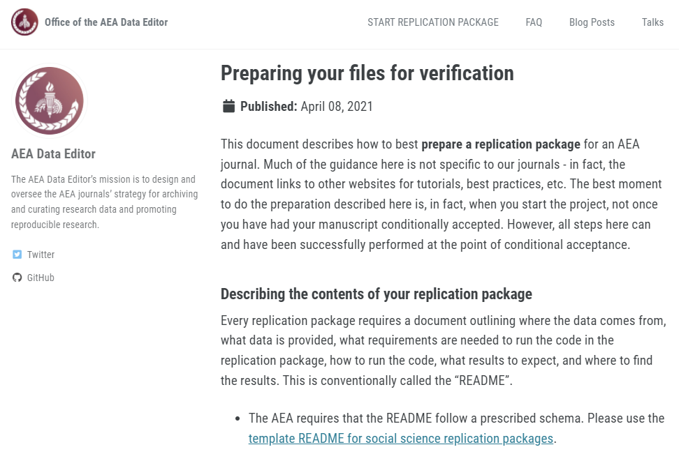
]


---

## Reproducibility

#### Why should we care?

--
- Because journals are interested in that these days. Yes, but why?

--

- Because it is a **fundamental principle of the scientific method**
  - With enough instructions, someone else can *verify* your experimental results and claims
  - It lends credibility to the scientific process

---

## Reproducibility

The term can have different meanings and (quasi) synonyms depending on the field

We'll borrow terminology from CS<sup>1</sup>

- **Repeatability**: same team, same experimental setup

--

- **Replicability**: *different* team, same experimental setup

--

- **Reproducibility**: *different* team, *different* experimental setup


.footnote[<sup>1</sup> Association for Computing Machinery (2021). *Artifact Review and Badging – Version 2.0*]

---

## Reproducibility

.pull-left[

- Reproducibility is the higher scientific goal

- For the projects we develop, we look for **replicability**

- We make it easy for someone else to run our analysis and get the same results
]

.pull-right[
  
]

---

## Automation

**Automate everything that can be automated**
<center>
  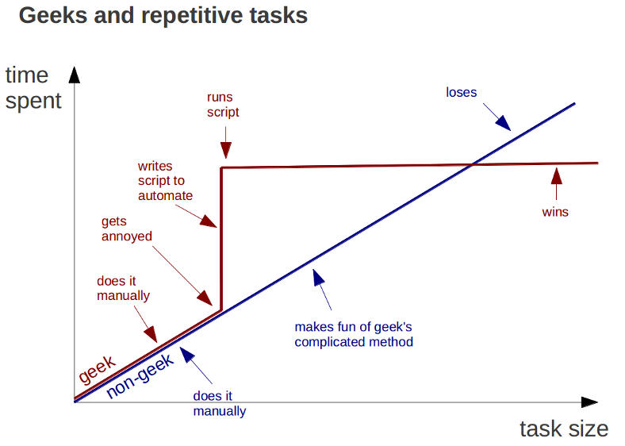
</center>

---

## Automation

**Automate everything that can be automated**

Scripts are great because they:
- Save time for repeated tasks
- Document step by step what you are doing
- Can usually be reused/adapted for similar tasks in the same or other projects

--

Manual tasks (with files or in Excel) are difficult to replicate unless you take detailed notes at every step

Rule-of-thumb: *if you are doing a lot of clicking for repeated task, think about writing a script for that*

---

## Automation

**Automate everything that can be automated**

My advice: *get comfortable with UNIX shell*

- You can do so much with basic shell scripting
  - You'll most likely need it if your research needs High-Performance Computing (HPC)
- You can learn that in a couple of hours with [Software Carpentry lessons](https://swcarpentry.github.io/shell-novice)
- Works in any OS
  - Mac: shell environment built in
  - Linux: you probably needed that already
  - Windows 10+: there's WSL2 and it works great (really!)


---

## Automation

**Write a single script that executes all code from beginning to end**

It's the ideal goal for *replication packages*

Have a script like this from the beginning of the project and increment it as you go

--

But don't obsess over it. Sometimes it can't be done
- E.g.: you are running part of your code on an external server


---

## Automation + replicability

An extra rule: **Keep track of your dependencies**

- We often use many external packages
- Popular packages get updated often. Sometimes it breaks things...
  - The syntax you used doesn't work anymore
  - The function you called doesn't exist anymore
- Keep note (and backups) of the versions you use
--

- There are many tools to help you with that
  - Some are simpler and just track that info for you .small[(e.g.: Dr. Watson for Julia)]
  - Others create a stand-alone environment with everything you need to run .small[(e.g.: Docker)]

---

class: inverse, center, middle
name:organization

# Organization

---

## Directories

**Separate directories by function**

**Separate files into inputs and outputs**

These are quite intuitive: they make it easy for you (your code) and anyone else to find things

Separating inputs, intermediate outputs (temp), and final outputs is crucial for storing the right things
- We normally don't use version control for intermediate calculations


---

## Directories
.pull-left[

Have separate folders for
- Code
- Data
- Output
  - I also use separate sub-folders for tables, figures, & maps
- Text (e.g. LaTeX files)

]

.pull-right[
<center>
  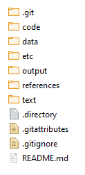
</center>
.small[.blue[^ This is from my job market paper]]
]

---

## Directories
For long scripts that do many steps in sequence, like building a data set, it is also a good practice to number your scripts

<center>
  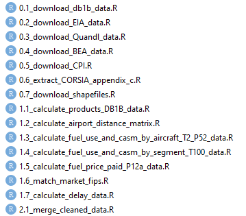
</center>

---

## Directories

**Make directories portable**

In other words: **use relative paths**. Or don't hard-code your paths

Instead of 

<code>C:/User/me/my_research/data/my_data_file.csv</code>

use a relative path like this

<code>data/my_data_file.csv</code>


---

## Directories

.pull-left[

It's not always possible to have relative paths everywhere

In that case, you can define all the paths in one single place and read it from there every time

But there are many packages to care of that for you (e.g., package `here` for R)
]

.pull-right[
<center>
  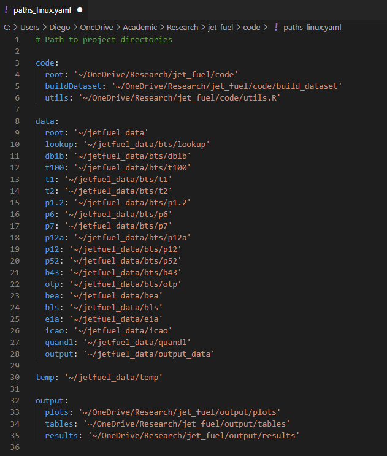
</center>
]

---

class: inverse, center, middle
name:management

# Project management

.footnote[\*This part borrows extensively from course materials from Grant McDermott's *Data Science for Economists* (Oregon) and Ivan Rudik's *Dynamic Optimization* (Cornell)]

---

## Before we continue...

By now you hopefully have
1. GitHub Desktop installed on your laptop
2. A GitHub account

After class, please:
- Send me an e-mail with your GitHub username
- Watch out for an invitation for our GitHub Classroom repository
- Accept the invitation


---

## Version Control: why bother?

<center>
  
</center>


---

## Git

- Git is a *distributed version control system*
  
  - Imagine if Dropbox and the "Track changes" feature in MS Word had a baby. Git would be that baby

--

- In fact, it's even better than that because Git is optimized for the things that economists spend a lot of time working on (e.g. code)

- It gives you an easy way to test out experimental changes (e.g. new specifications, additional model states) and not have them mess with your main code

---

## GitHub

**Git $\neq$ GitHub**

--

- GitHub hosts a bunch of online services we want when using Git
  - Hosts a copy of your repository online
  - Allows for people to suggest changes to your project
  - Keeps track of team communication on tasks
  - And even let's you host some related content (like these slides!)
  - You can even program and run your code on GitHub Codespaces

- It's also the main location for non-base Julia (and R) packages to be stored and developed

---

## The differences

**Git** is the software infrastructure for versioning and merging files

--

**GitHub** provides an online service to coordinate working with Git repositories
- And adds some additional features for managing projects
  - Stores the project on the cloud, allows for task management, creation of groups, etc

---

## Why Git(Hub)?

#### Selfish reasons

--

- The private benefits of having well-versioned code in case you need to go back to previous stages

--

- Your directories will be super clean

--

- Makes it .red[MUCH] easier to collaborate on projects

---

## Why Git(Hub)?

#### Semi-altruistic reasons

--

- The external benefits of open science, collaboration, etc

--

- These external benefits also generate some downstream private reputational benefits
  - You must be confident in your code to make it public
  
- Can improve future social efficiency
  - You commit to post future code (if you don't, it'll look shady)


---

## Git basics

Everything on Git is stored in something called a **repository** or *repo* for short. This is the directory for a project

--

- **Local**: a directory with a `.git` subdirectory that stores the history of changes to the repository
- **Remote**: a website, e.g. see the GitHub repo for the [Optim](https://github.com/JuliaNLSolvers/Optim.jl) package in Julia


---

## Git basics

<div align="center">
  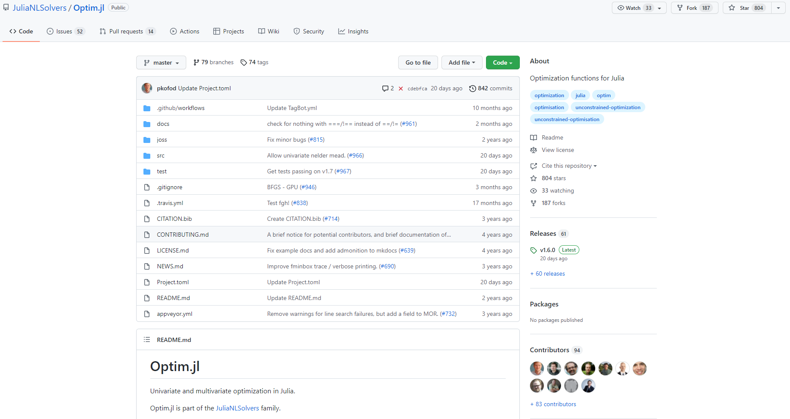
</div>

---

## Creating a new repo on GitHub

#### Let's create a new repo

--

Easy from GitHub website: just click on that green `New` button from the launch page
<div align="center">
  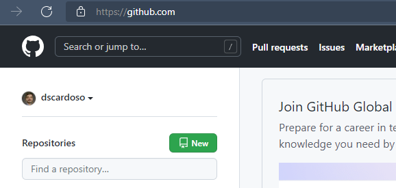
</div>

---

## Creating a new repo on GitHub

Next steps:
1. Choose a name
2. Choose a description
3. Choose whether the repo is public or private
4. Choose whether you want to add a `README.md` (yes), or a `.gitignore` or a `LICENSE.md` file (more next slide) 

---

## Creating a new repo on GitHub

<div align="center">
  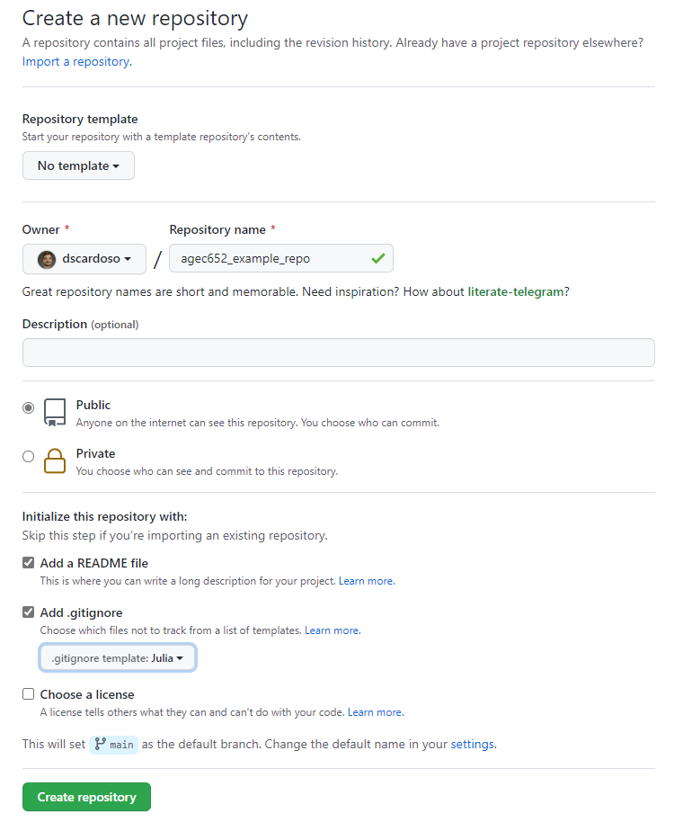
</div>

---

## Creating a new repo on GitHub

Repos come with some common files in them

- `.gitignore`: lists files/directories/extensions that Git shouldnt track (raw data, restricted data, those weird LaTeX by-product files). This is usually a good idea

- `README.md`: a Markdown file that is basically the welcome content on repo's GitHub website. You should generally initialize a repo with one of these

- `LICENSE.md`: describes the license agreement for the repository

---

## Repo of Optim.jl again

<div align="center">
  
</div>

---

## Creating a new repo on GitHub

You can find the repo at [https://github.com/dscardoso/agec652_example_repo](https://github.com/dscardoso/agec652_example_repo)

<div align="center">
  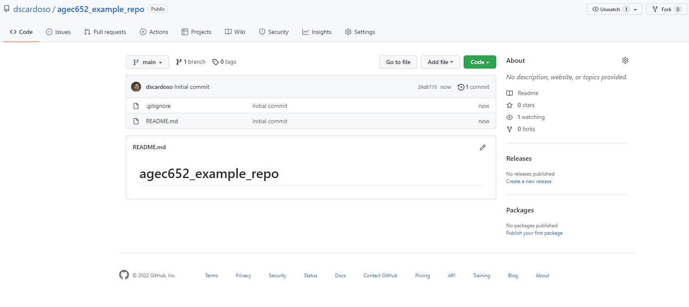
</div>


---

## How do I get a repo on GitHub onto on my computer?

**`Clone`**

To get the repository on your local machine you need to **clone** the repo

--

Key thing: this will **link** your local repository to the remote
  - You'll be able to update your local when the remote is changed

---

## Cloning

<div style="float: right">
  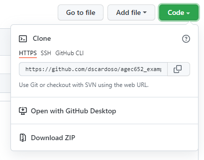
</div>

Click on
- `Code` > `Open with GitHub Desktop`

You can also use git command line for that (we won't cover it here)

---
#.blue[Your turn!]

Create and clone your own repository on GitHub and initialize it with a `README.md` file

---

## Git workflow

.blue[Workspace]: actual files on your computer  
.blue[Repository/local]: your saved local history of changes to the files in the repository  
.blue[Remote/origin]: remote repository on GitHub that allows for sharing across collaborators

<div align="center">
  
</div>

---

## Using Git

There are only a few basic Git operations you need to know for versioning solo economics research efficiently

--

**Add/Stage**: Add files & modifications to the index
  - Take a snapshot of the changes you want updated/saved in your local repository (i.e. your computer)

--

**Commit**: Record the changes to your local repository
  - This requires a short message to record what was done or changed

---

## Using Git

**Push**: Send the changes you committed in the local repository to the remote repository (i.e. GitHub)


--

**Pull**: Take changes on the remote and integrate them with the local repository 
  - Technically two operations: `fetch` and `merge`

  
---

## Git workflow: a sequence

<div align="center">
  
</div>

---

# .blue[Your turn!]

In your own repository do the following:

--

1. Open `README.md` in some text editor and insert the following code: `# Hello World!`
2. Save `README.md`
3. Add the changes to `README.md` to the index
4. Commit the changes to your local repo with the message: "First README.md edit."
5. Push the changes to your remote

--

Did the changes show up your repo's GitHub page?


---

## Using Git: branching

Some more (but not very) advanced operations relate to **branching** and **pull requests**

Branching creates different, but parallel, versions of your code
- If you want to test out a new feature of your model but don't want to contaminate your `main` branch, create a new branch and add the feature there
- If it works out, you can bring the changes back into `main`
- If it doesn't, just delete it

---

## Using Git: branching

It is easy to create a branch on GitHub Desktop

<div align="center">
  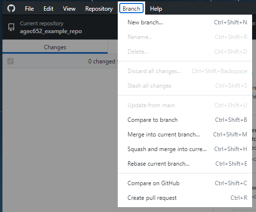
</div>

---

## Using Git: branching

It is easy to create a branch on GitHub Desktop

<div align="center">
  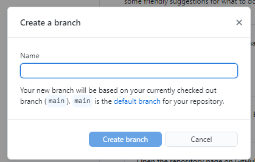
</div>

---

## Using Git: branching

And also to switch and merge your branch into the `main`

<div align="center">
  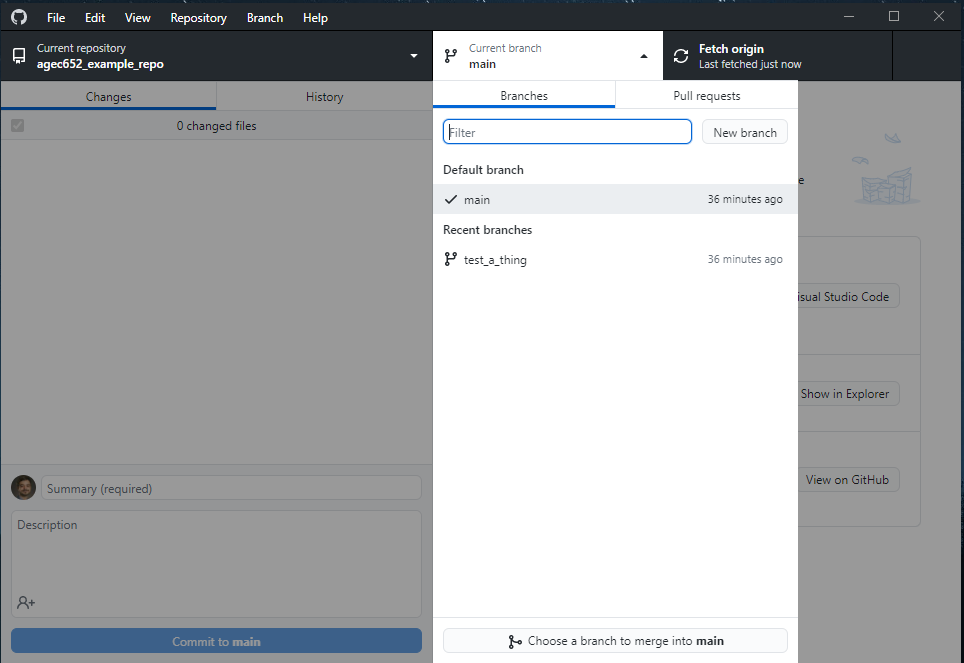
</div>

---

#.blue[Your turn!]

In your own repository do the following:

1. Create a new branch called `test-branch`
2. Edit `README.md` and add the following code: `## your_name_here`
3. Save `README.md`
4. Add the changes to `README.md` to the index
5. Commit and push the changes with the message: "Test change to README.md."
6. Switch to the `main` branch
7. Choose your `test-branch` to merge into the `main` branch
8. Push the changes to your remote
9. Check your repo's GitHub page

---

## Pull requests

- The branch + merge we just did is the standard workflow if you are working alone

- When you are working with collaborators, before merging it is *best to announce first* that you have finished the branch or completed a new feature

- This is done with a **pull request**

--

- In practice, this is also a way to group a bunch of commits into a single new feature and let others know about it

---

## Pull requests

Once you have committed and pushed changes to a branch, you create a new pull request on GitHub Desktop...

<div align="center">
  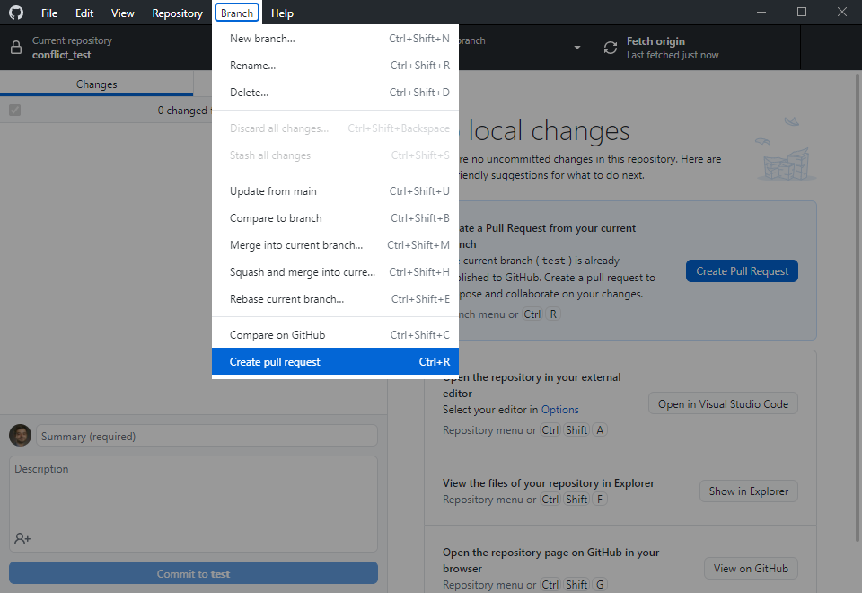
</div>

---

## Pull requests

...or on the GitHub website

<div align="center">
  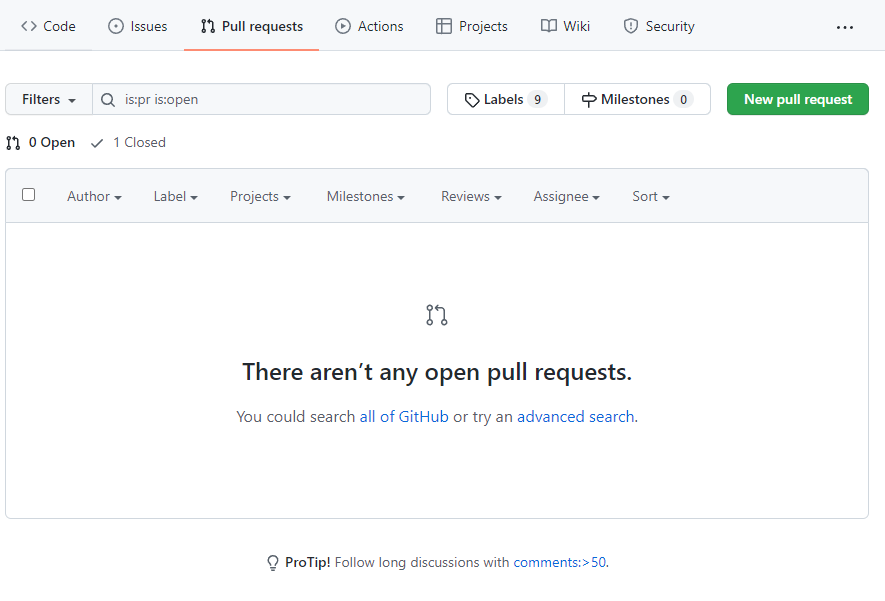
</div>

---

## Pull requests

Enter a description and assign any reviewers

<div align="center">
  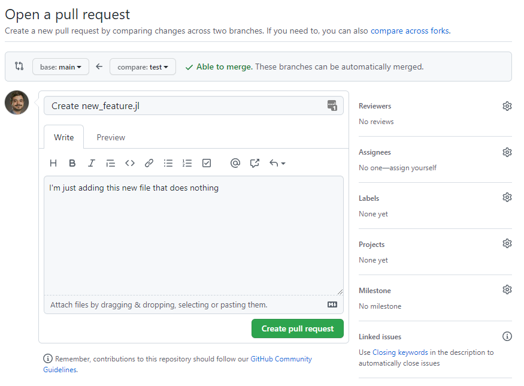
</div>

---

## Pull requests

Once you and your collaborators are happy with it, just go ahead and `merge pull request`

<div align="center">
  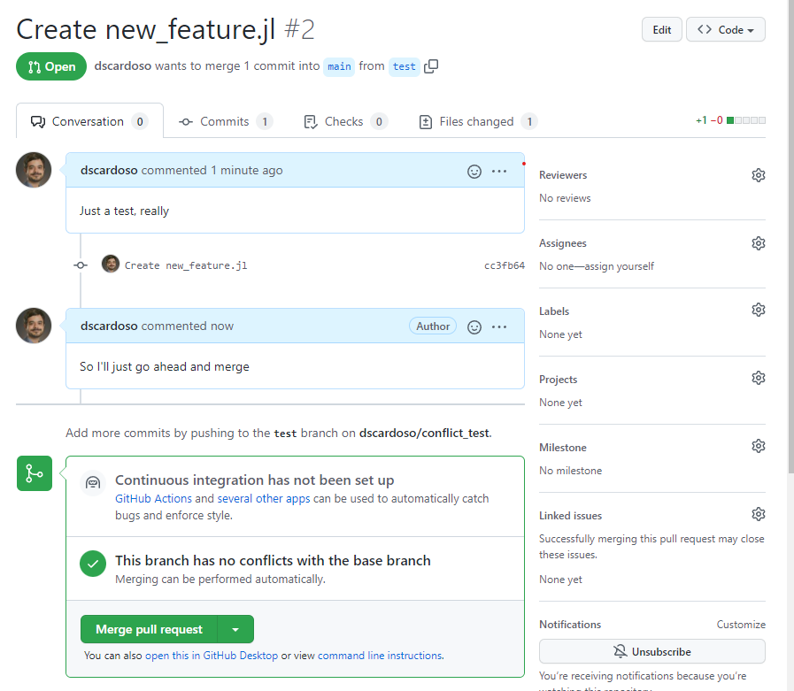
</div>

---


## Pull requests

And you're done!

<div align="center">
  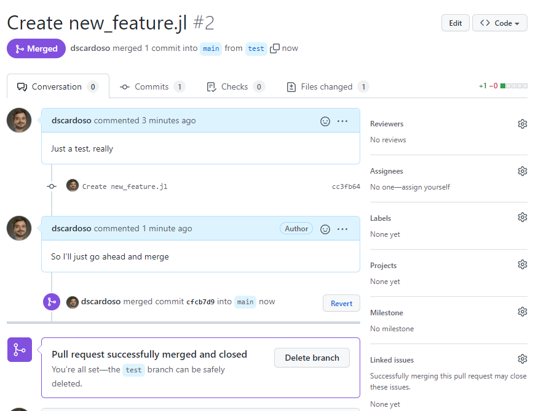
</div>

---


#.blue[Your turn!]

In your own repository do the following:

1. Switch back to `test-branch`
2. Create a new file called `new_feature.jl` and write anything in it
3. Commit and push the changes with the message "Adding new feature"
4. Create a pull request and add "New feature" as a description
  - (Here is where you and collaborators would discuss/agree)
5. Go ahead and "Merge pull request"


---


#.blue[Team up]

1. Find a partner for this next piece
2. One of you invites the other to collaborate on the project: GitHub page > Settings > Manage access > invite a collaborator

<div align="center">
  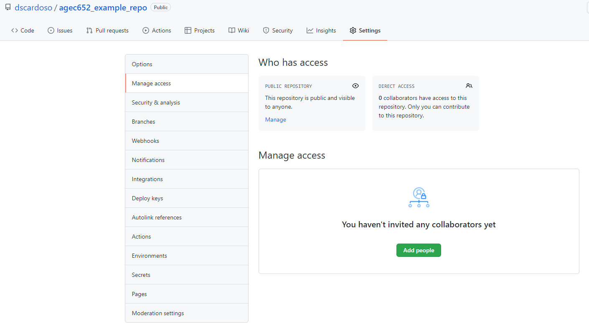
</div>


---

#.blue[Team up]

If you were the one being invited, accept the invite, and clone the repo to your local

--

Now do the following:

1. Each of you edit the `# Hello World!` line of code to be something else and different from each other
2. Commit the changes to your local
3. Have the repo creator push their changes
4. Have the collaborator push their changes

---

## Can't push changes when you aren't updated

It turns out that the second person can't push their local changes to the remote

The second person is pushing their history of changes

But the remote is already one commit ahead because of the first person, so the second person's changes can't be pushed

---

## Update by pulling after you commit local changes

You need to pull the remote changes first. But then you try to pull your commit and you get a **merge conflict** in `README.md`

<div align="center">
  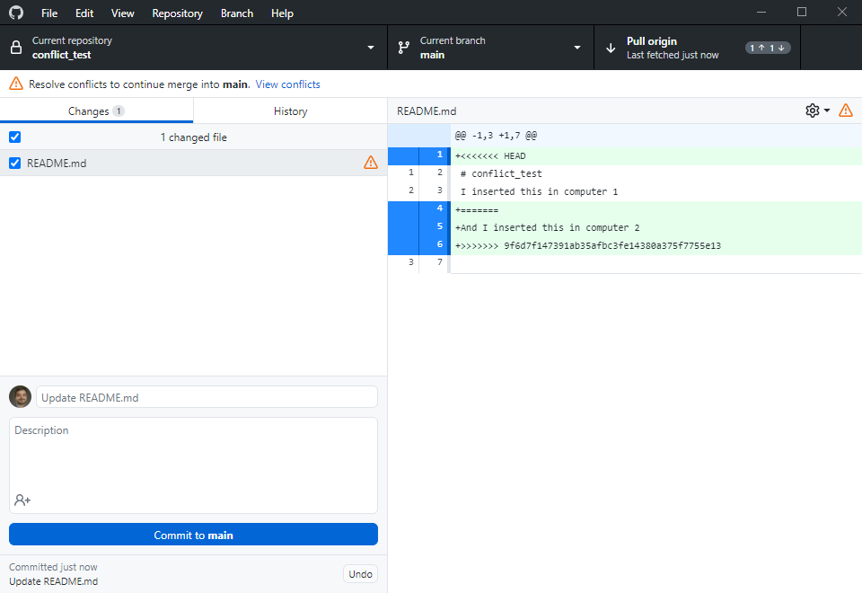
</div>


---

## Merge conflicts

This means there were differences between the remote and your local that conflicted

--

Sometimes there will be conflicts between two separate histories
  - E.g. if you and your collaborator edited the same chunk of code separately on your local repos
--

  - When you try to merge these histories by pushing to the remote, Git will throw a **merge conflict**

---

## Merge conflicts

Good code editors (like Visual Studio Code) "understand" git and will show you nicely where the conflict is

<div align="center">
  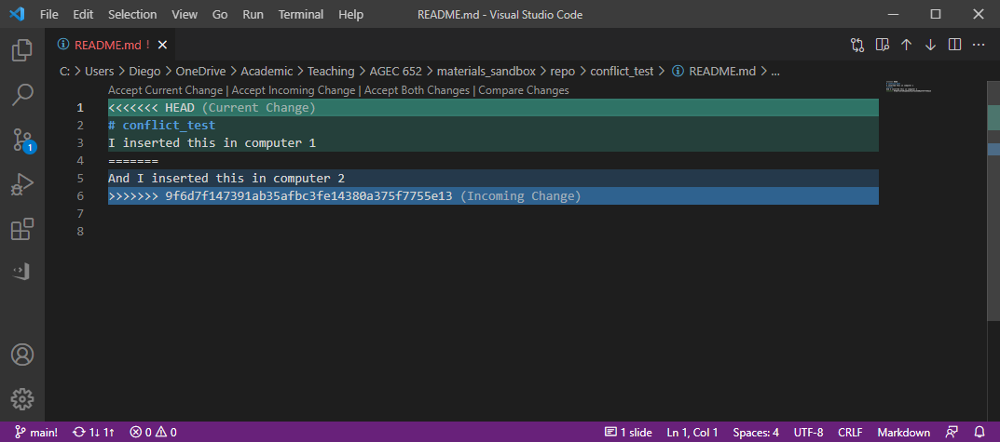
</div>
---

## Solving merge conflicts

```{bash, eval = FALSE}  
<<<<<<< HEAD
```
Indicates the start of the conflicted code  
--

```{bash, eval = FALSE}  
=======
```
Separates the two different conflicting histories  

--
```{bash, eval = FALSE}  
>>>>>>> lots of numbers and letters
```
Indicates the end of the conflicted code and the hash (don't worry about it) for the specific commit


---

## Fixing a merge conflict

Merge conflicts can be fixed by directly editing the file. Then `Continue merge` on GitHub Desktop. Fixed!

<div align="center">
  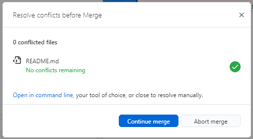
</div>


---
class:inverse,center,middle

# Let's get back to Gentzkow and Shapiro's rules

---

## Version control

**Store code and data under version control**

- Now you know how to do that with Git(Hub)
- But I don't recommend using it for large data sets
  - Might actually be impossible because GitHub sets a strict size limit of 100 MB per file
  - For large data, use Dropbox/OneDrive/Box
  - For restricted/confidential data: DEFINITELY don't use any of the above

--

**Run the whole directory before checking it back in**

- In other words: *avoid committing a version with bugs or that breaks other code in your project*


---

## Management

**Manage tasks with a task management system**

**E-mail is not a task management system**

- You can do that in GitHub!
  - With the added benefit that you can easily link changes to tasks (we'll that in a bit) 

- But there are many other tools
  - Some examples: Asana, Trello, Notion, and even Outlook tasks 


---


## Managing tasks and workflow with GitHub

GitHub is also very useful for task management in solo or group projects using **issues** and **pull requests**

**Issues**: task management for you and your collaborators
- It should be able to completely replace email
  - With the added benefit of organizing your discussions and decisions by topic

--

Let's look at the issues for the `Optim` package in Julia

---

## Issues

<div style="float: right">
  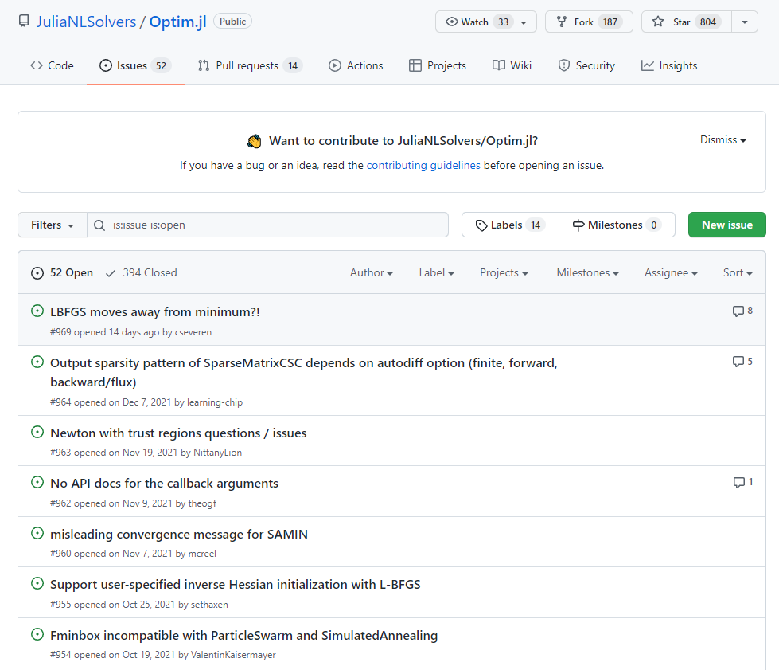
</div>

- The issues tab reports a list of 56 open issues (286 closed, i.e., task or problem has been solved)

- Each issue has its own title

- Let's one example of issue

---

## Issues

<div style="float: right">
  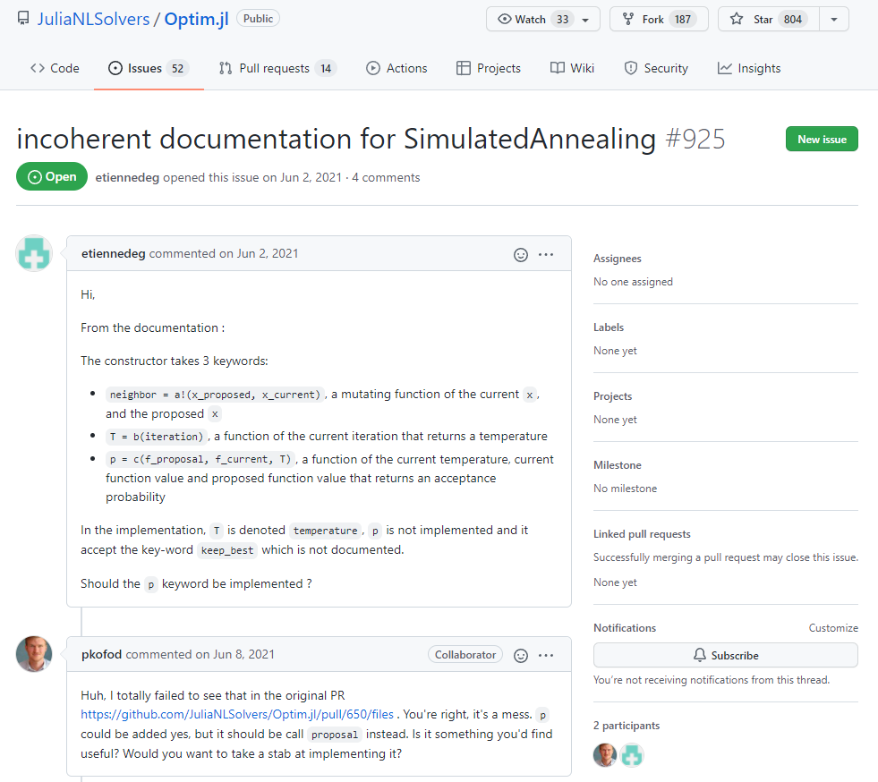
</div>

One person reported issues with the documentation of a function, which does not match the actual function

Someone else has responded with some feedback

---

## Issues

It is easy to creat a new task or *issue*: from the issues tab, click the green **new issue** button which takes you here

<div align = "center">
  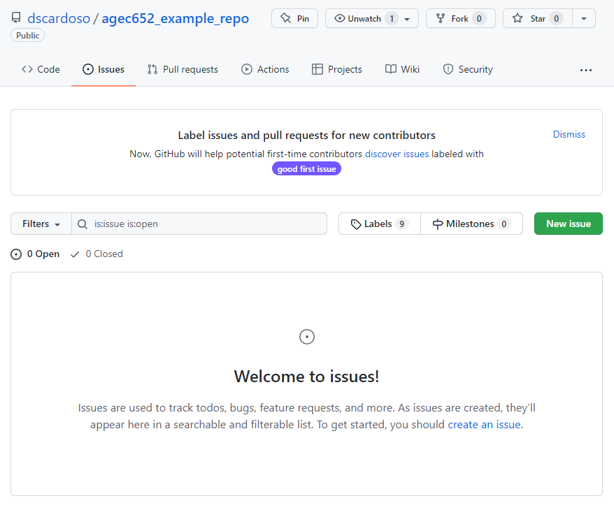
</div>


---

## Issues

<div style="float: right">
  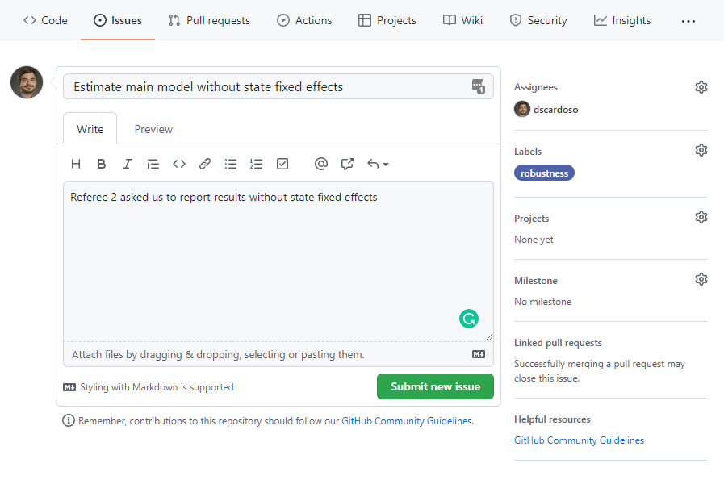
</div>

Then you can
- Add a title
- Add a description
- Assign the task to a collaborator
- Add labels/tags

---

## Issues

The issue keeps track of the history of everything that's happened to it

<div align = "center">
  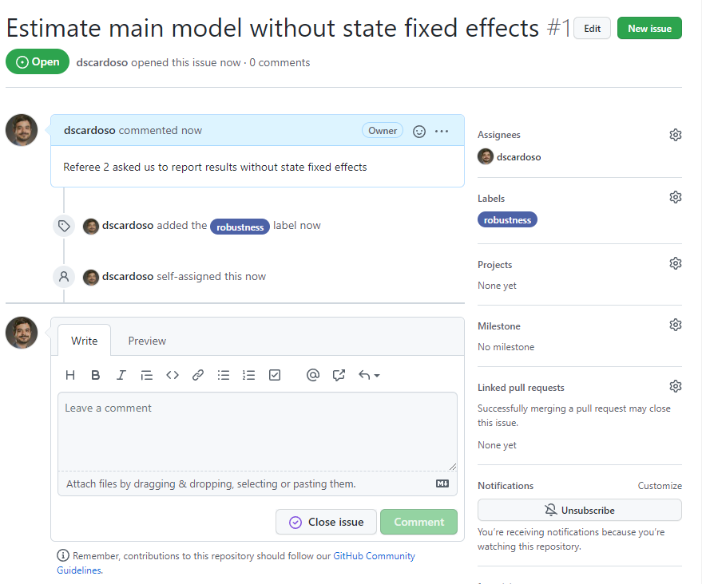
</div>


---

## Issues

You can reference people with `@` which brings up a dropdown menu of all collaborators on the project

<div align = "center">
  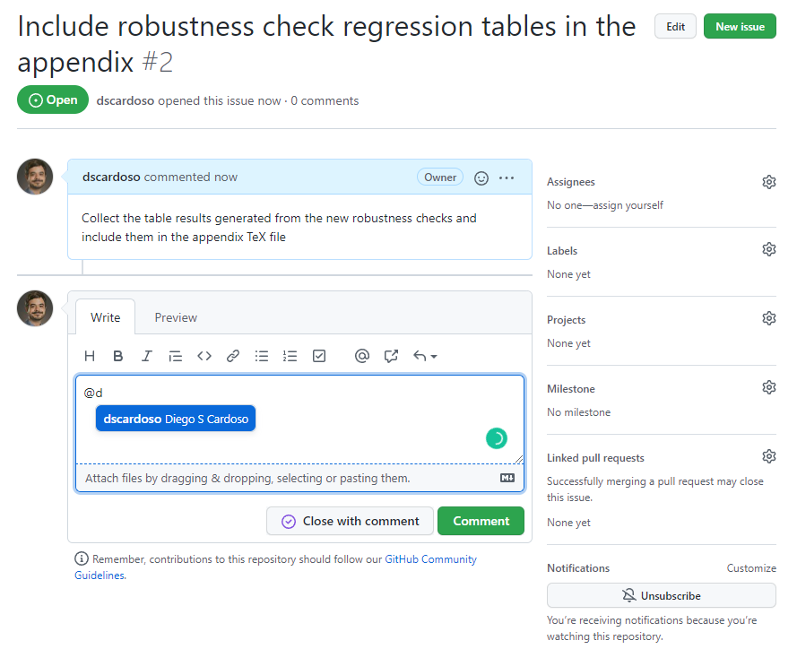
</div>

---

## Issues

You can also reference *other issues* if they're related by using `#` which brings up a dropdown of all issues for your repository

<div align = "center">
  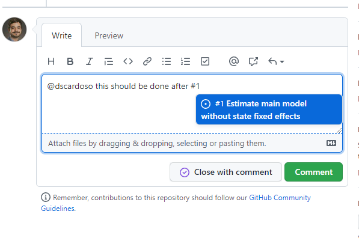
</div>


---

## Issues

Issues can also be referenced in your commits to your project by adding `#issue_number_here` to the commit message

<div align = "center">
  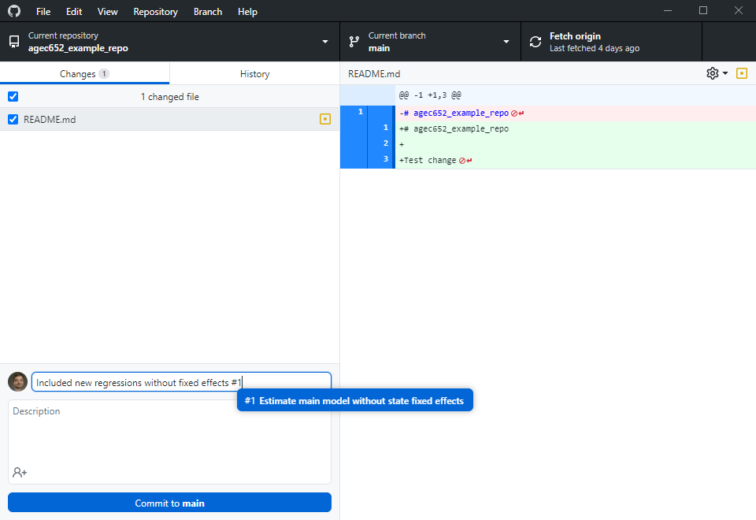
</div>

---

## Issues

Then those commits show up in your issue so you have a history of what code changes have been made

<div align = "center">
  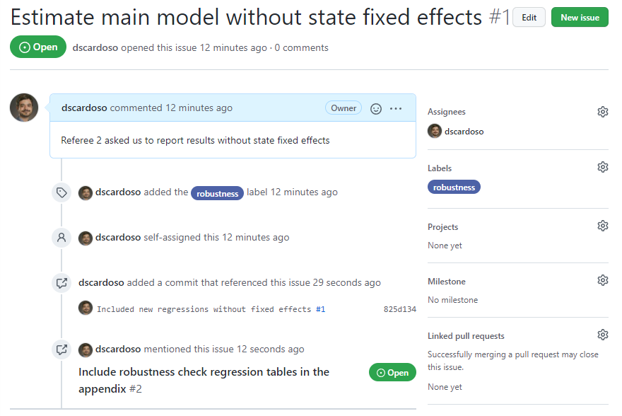
</div>


---

## Issues


If you click on the commit, it takes you to the `git diff` which shows you any changes to files made in that commit

<div align = "center">
  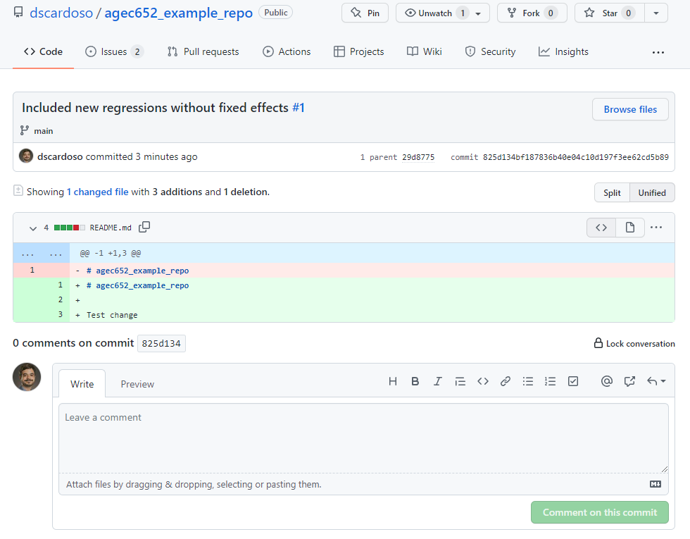
</div>


---


## Other stuff on GitHub

- GitHub keeps adding new features for project management
- Three of the newest additions are 
  - **Discussions**: basically a messaging board for your repo. Threads can be created independent of issues
  - **Projects**: let you create organization spaces with Kanban boards (To do/Doing/Done columns)
  - **Codespaces**: let you create virtual machines with all your software that you can program and run from a browser 
      - They give you free computing hours per month, but you gotta pay for more time or better computers
    


---
class: inverse, center, middle
name: faq

# Git FAQ

---

## FAQ

**Q: When should I commit (and push) changes?**

*A: Early and often*

- It's not quite as important as saving your work regularly, but it's a close second
- You should certainly push everything that you want your collaborators to see

---

## FAQ

**Q: Do I need branches if I am working on a solo project?**

*A: You don't really need them, but they offer big advantages in maintaining a sane workflow*

- Experiment without any risk to the main project!

---

## FAQ 

**Q: What's the difference between cloning and forking a repo?**

*A: Cloning directly ties your local version to the original repo, while forking creates a copy on your GitHub (which you can then clone)*
- [Cloning](http://happygitwithr.com/clone.html) makes it easier to fetch updates (and is often the best choice for new GitHub users), but [forking](http://happygitwithr.com/fork.html) has advantages too.

---

## FAQ 

**Q: What happens when something goes wrong?**

*A: Look for help*
- Command line-based fixes: [ohshitgit.com](http://ohshitgit.com)
- Also, search on [Stack Exchange](https://stackexchange.com)
  
---

## FAQ 

**Q: What happens when something goes <i>horribly</i> wrong?**

*A: Burn it down and start again:* [http://happygitwithr.com/burn.html](http://happygitwithr.com/burn.html)

<div style="float: right">
  
</div>

- This is a great advantage of Git's distributed nature:
  - If something goes horribly wrong, there's usually an intact version somewhere else

---

class: inverse, center, middle
name: faq

# Appendix
## Submitting your work with GitHub Classroom

---

## Submitting your work

- More details to come