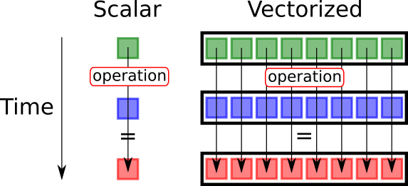

exclude: true
```{r setup}
if (!require("pacman")) install.packages("pacman")
pacman::p_load(
  xaringanthemer, JuliaCall
)

#options(htmltools.dir.version = FALSE)

knitr::opts_hooks$set(fig.callout = function(options) {
  if (options$fig.callout) {
    options$echo <- FALSE
  }

  knitr::opts_chunk$set(echo = TRUE, fig.align="center")
  options
})

```

```{r xaringan-themer, include=FALSE, warning=FALSE}
library(xaringanthemer)
style_mono_accent(
  base_color = "#8E6F3E", 
  header_font_google = google_font("Josefin Sans"),
  text_font_size = "28px",
  colors = c(
    red = "#f34213",
    gold = "#CFB991",
    gray = "#C0C0C0",
    blue = "#295fbe",
    black = "#000000"
  )
)

extra_css <- list(
  ".small" = list("font-size" = "90%"),
  ".big" = list("font-size" = "125%"),
  ".footnote" = list("font-size" = "60%"), 
  ".full-width" = list(
    display = "flex",
    width   = "100%",
    flex    = "1 1 auto"
  )
)

style_extra_css(css = extra_css)

```

```{julia}
using Pkg
Pkg.activate(".")
Pkg.instantiate()
Pkg.add("BenchmarkTools")
```


---

## Software requirements

By now you hopefully have installed
- Julia

- Visual Studio Code with Julia extension

---

class: inverse, center, middle

# Programming with Julia

.footnote[\*These slides are based on Software Carpentry, notes by Ivan Rudik and Grant Mcdermott, QuantEcon, and Julia documentation.]

---

## Why learn Julia?

**Reason 1: It is easy to learn and use**

Julia is a *high-level* language
- Low-level = you write instructions are closer to what the hardware understands (Assembly, C++, Fortran)
  - .small[E.g.: ]
  - .small[These are usually the fastest because there is little to translate (what a compiler does) and you can optimize your code depending on your hardware]
- High-level means you write in closer to human language (Julia, R, Python)
  - .small[The compiler has to do a lot more work to translate your instructions]

---

## Why learn Julia?

**Reason 2: Julia delivers C++ and Fortran speed**

.small[Sounds like magic, but it's just a clever combination of design choices targeting numerical methods]

<div align="center">
  
</div>

.center[.footnote[*In this graph, time to execute in C++ is 1]]

---

## Why learn Julia?

**Reason 3: Julia is free, open-source, and popular**

- You don't need expensive licenses to use (unlike Matlab)

- The people who want to use or verify what you did also don't have to pay

- There is a large and active community of users and developers
  - So it's easy to get help and new packages


---

## Tools for programming in Julia

There are 2 *Integrated Development Environments (IDEs)* I generally recommend

1. Visual Studio (VS) code
2. Jupyter Lab notebooks

.blue[Please watch the "IDE showcase" video on Brightspace for an intro]

--

In this course, we will only program plain `.jl` files, so I highly recommend you get familiarized with VS code

--

- At the end of this unit, we will talk about using AI tools to help you learn to code and become a more productive programmer
  - BUT **PLEASE PLEASE**, DON'T USE AI TOOLS YET

---


## Intro to programming

### Programming $\equiv$ writing a set of instructions

- There are hard rules you can't break if you want your code to work

--

- There are elements of style (e.g. Strunk and White) that make your code easier to read, modify, and maintain

--

- There are elements that make your code more efficient
  - Using less time or space (memory)


---

## Intro to programming

If you will be doing computational work, there are:

1. Language-independent coding basics you should know
    - Arrays are stored in memory in particular ways
    
2. Language-independent best practices you should use
    - Indent to convey program structure, naming conventions
    
3. Language-dependent idiosyncracies that matter for function, speed, etc
    - Julia: type stability; R: vectorize

---

## Intro to programming

Learning these early will:

1. Make coding a lot easier
--

2. Reduce total programmer time
--

3. Reduce total computer time
--

4. Make your code understandable by someone else or your future self
--

5. Make your code flexible

---

## A broad view of programming

Your goal is to make a **program**

A program is made of different components and sub-components

--

The most basic component is a **statement**, more commonly called a **line of code**


---

## A broad view of programming

Here is an example of a pseudoprogram:

```julia
*deck = ["4 of hearts", "King of clubs", "Ace of spades"]
shuffled_deck = shuffle(deck)
first_card = shuffled_deck[1]
println("The first drawn card was " * shuffled_deck ".")
```

This program is very simple:

1. Create a deck of cards

---

## A broad view of programming

Here is an example of a pseudoprogram:

```julia
deck = ["4 of hearts", "King of clubs", "Ace of spades"]
*shuffled_deck = shuffle(deck)
first_card = shuffled_deck[1]
println("The first drawn card was " * shuffled_deck ".")
```

This program is very simple:
1. Create a deck of cards
2. Shuffle the deck

---

## A broad view of programming

Here is an example of a pseudoprogram:

```julia
deck = ["4 of hearts", "King of clubs", "Ace of spades"]
shuffled_deck = shuffle(deck)
*first_card = shuffled_deck[1]
println("The first drawn card was " * shuffled_deck ".")
```

This program is very simple:
1. Create a deck of cards
2. Shuffle the deck
3. Draw the top card

---

## A broad view of programming

Here is an example of a pseudoprogram:

```julia
deck = ["4 of hearts", "King of clubs", "Ace of spades"]
shuffled_deck = shuffle(deck)
first_card = shuffled_deck[1]
*println("The first drawn card was " * shuffled_deck ".")
```

This program is very simple:
1. Create a deck of cards
2. Shuffle the deck
3. Draw the top card
4. Print it

---

## A broad view of programming

```julia
deck = ["4 of hearts", "King of clubs", "Ace of spades"]
shuffled_deck = shuffle(deck)
first_card = shuffled_deck[1]
println("The first drawn card was " * shuffled_deck ".")
```

What are the parentheses and why are they different from square brackets?

How does shuffle work?

What’s `println`?

It’s important to know that a **good program has understandable code**

---

## Julia specifics

We will discuss coding in the context of Julia
but a lot of this ports to Python, MATLAB, etc<sup>1</sup>

We will review

1. Types
2. Iterating
3. Broadcasting/vectorization
4. Scope
5. Generic functions
6. Multiple dispatch


.footnote[<sup>1</sup>See [https://cheatsheets.quantecon.org](https://cheatsheets.quantecon.org)]

---

class: inverse, center, middle

# 1. Types

---

## Types: boolean

All languages have some kind of **variable types** like *integers* or *arrays*

--

The first type you will often use is a boolean (`Bool`) variable that takes on a value of `true` or `false`:
```{julia}
x = true
typeof(x)
```

---

## Types: boolean

We can save the boolean value of actual statements in variables this way:
```{julia}
@show y = 1 > 2
```

`@show` is a Julia macro for showing the operation. 
- .small[You can think of a macro as a shortcut name that calls a bunch of other things to run]

---

## Quick detour: logical operators

Logical operators work like you'd think

`==` (equal equal) tests for equality

```{julia}
1 == 1
```

--

`!=` (exclaimation point equal) tests for inequality

```{julia}
2 != 2
```

---

## Quick detour: logical operators


You can also test for approximate equality with $\approx$ (type `\approx<TAB>`)


```{julia}
1.00000001 ≈ 1
```

--

Now back to types

---

## Types: numbers

Two other data types you will use frequently are integers
```{julia}
typeof(1)
```

--

and floating point numbers
```{julia}
typeof(1.0)
```

- .small[64 means 64 bits of storage for the number, which is probably the default on your machine]

---

## Types: numbers

You can always instantiate alternative floating point number types

```{julia}
converted_int = convert(Float32, 1.0);
typeof(converted_int)
```

---

## Types: numbers

### Math works like you would expect:
```{julia}
a = 2
b = 1.0
a * b
```

--

```{julia}
a^2
```

---

## Types: numbers

```{julia}
2a - 4b
```

--

```{julia}
@show 4a + 3b^2
```

--

.blue[In Julia, you dont need `*` in between numeric literals (numbers) and variables]

---

## Types: strings

Strings store sequences of characters

You implement them with double quotations:

```{julia}
x = "Hello World!";
typeof(x)
```

--

.blue[Note that `;` is used to suppress output for that line of code. Unlike some other languages, in Julia you don't need to add `;` after every command]

---

## Types: strings

It's easy to work with strings. Use `$` to interpolate a variable/expression
```{julia}
x = 10; y = 20; println("x + y =  $(x+y).")
```

--

Use `*` to concatenate strings
```{julia}
a = "Aww"; b = "Yeah!!!"; println(a * " " * b)
```

--

You probably won't use strings too often unless you're working with text data or printing output. 
--
.blue[Note that `;` can also be used to type multiple commands in the same line. I'm doing it make it fit in this slide, but you should avoid it]


---

## Types: containers

Containers are types that store collections of data

--

The most basic container is the `Array` which is denoted by square brackets

--


```{julia}
a1 = [1 2; 3 4]; typeof(a1)
```

--

Arrays are **mutable**, which means you can change their values

--

```{julia}
a1[1,1] = 5; a1
```

You reference elements in a container with square brackets

---

## Types: containers

An alternative to the `Array` is the `Tuple`, which is denoted by parentheses

--

```{julia}
a2 = (1, 2, 3, 4); typeof(a2)
```
`a2` is a `Tuple` of 4 `Int64`s. Tuples have no dimension

---

## Types: containers

Tuples are **immutable** which means you **can't** change their values
```{julia}
try
  a2[1,1] = 5;
catch
  println("Error, can't change value of a tuple.")
end
```

---

## Types: containers

Tuples don't need parentheses (but it's probably best practice for clarity)
```{julia}
a3 = 5, 6; typeof(a3)
```

---

## Types: containers

Tuples can be **unpacked** 

--

```{julia}
a3_x, a3_y = a3;
a3_x
a3_y
```

--

This is basically how functions return output when you call them

---

## Types: containers

But an alternative and more efficient container is the  [`NamedTuple`](https://docs.julialang.org/en/v1/manual/types/#Named-Tuple-Types-1) 

```{julia}
nt = (x = 10, y = 11); typeof(nt)
nt.x
nt.y
```

Another way of accessing `x` and `y` inside the NamedTuple is

```{julia}
nt[:x]; nt[:y];
```


---

## Types: containers

A `Dictionary` is the last main container type. They are like arrays but are indexed by keys (names) instead of numbers

--

```{julia}
d1 = Dict("class" => "AAAA999", "grade" => 97);
typeof(d1)
```

--

`d1` is a dictionary where the key are strings and the values are any kind of type

---

## Types: containers

Reference specific values you want in the dictionary by referencing the key

--

```{julia}
d1["class"]
d1["grade"]
```

---

## Types: containers

If you just want all the keys or all the values, you can use these base functions

```{julia}
keys_d1 = keys(d1)
values_d1 = values(d1)
```

---

class: inverse, center, middle

# 2. Iteration

---

## Iterating

As in other languages we have loops at our disposal:

`for` loops iterate over containers
```{julia}
for count in 1:10
  random_number = rand()
  if random_number > 0.2
    println("We drew a $random_number.")
  end
end
```

---

## Iterating

`while` loops iterate until a logical expression is false
```{julia}
while rand() > 0.5
  random_number = rand()
  if random_number > 0.2
    println("We drew a $random_number.")
  end
end
```

---

## Iterating

An `Iterable` is something you can loop over, like arrays

--

```{julia}
actions = ["codes well", "skips class"];
for action in actions
    println("Charlie $action")
end
```

---

## Iterating

The type `Iterator` is a particularly convenient subset of Iterables

--

These include things like the dictionary keys:
```{julia}
for key in keys(d1)
  println(d1[key])
end
```

---

## Iterating

Iterating on `Iterator`s is more *memory efficient* than iterating on arrays

--

Here's a **very** simple example. The top function iterates on an `Array`, the bottom function iterates on an `Iterator`:

--

```{julia}
function show_array_speed()
  m = 1
  for i = [1, 2, 3, 4, 5, 6]
    m = m*i
  end
end;

function show_iterator_speed()
  m = 1
  for i = 1:6
    m = m*i
  end
end;
```

---

## Iterating


```{julia}
using BenchmarkTools
@btime show_array_speed()
@btime show_iterator_speed()
```

The `Iterator` approach is faster and allocates no memory

`@btime` is a macro from `BenchmarkTools` that shows you the elasped time and memory allocation

---

## Neat looping

A nice thing about Julia vs MATLAB: your loops can be much neater because you don't need to index when you just want the container elements

--

```{julia}
f(x) = x^2;
x_values = 0:20:100;
for x in x_values
  println(f(x))
end
```

---

## Neat looping

This loop directly assigns the elements of `x_values` to `x` instead of having to do something clumsy like `x_values[i]`

--

`0:20:100` creates something called a `StepRange` (a type of `Iterator`) which starts at `0`, steps up by `20` and ends at `100`


---

## Neat looping

You can also pull out an index and the element value by enumerating

```{julia}
f(x) = x^2;
x_values = 0:20:100;
for (index, x) in enumerate(x_values)
  println("f(x) at value $index is $(f(x)).")
end
```

`enumerate` basically assigns an index vector

---

## Neat looping

There is also a lot of Python-esque functionality to loop without indexes

For example: `zip` lets you loop over multiple different iterables at once

--

```{julia}
last_name = ("Lincoln", "Bond", "Walras");
first_name = ("Abraham", "James", "Leon");

for (first_idx, last_idx) in zip(first_name, last_name)
  println("The name's $last_idx, $first_idx $last_idx.")
end
```

---

## Neat looping

Nested loops can also be made very neatly

--

```{julia}
for x in 1:3, y in 3:-1:1
  println("$x minus $y is $(x-y)")
end
```

--

The first loop is the *outer* loop, the second loop is the *inner* loop

---

## Comprehensions: the neatest looping

Comprehensions are an elegant way to use iterables that makes your code cleaner and more compact

--

```{julia}
squared = [y^2 for y in 1:2:11]
```

This created a 1-dimension `Array` using one line

---

## Comprehensions: the neatest looping

We can also use nested loops for comprehensions

--

```{julia}
squared_2 = [(y+z)^2 for y in 1:2:11, z in 1:6]
```

This created a 2-dimensional `Array`

--

Use this (and the compact nested loop) sparingly since it's hard to follow

---

class: inverse, center, middle

# 3. Broadcating/Vectorization

---

## Vectorization

Iterated operations element by element is usually an inefficient approach

Another way is to do operations over an entire array. This is called **vectorization**

<div style="float: right">
  
</div>

- .small[It's faster because your processor can do some operations over multiple values with one instruction]
- .small[We'll get a better idea next lecture when we review the basics of computer architecture]


---

## Dot syntax: broadcasting/vectorization

Vectorizing operations is easy in Julia: just use *dot syntax* (like in MATLAB)

--

```{julia}
g(x) = x^2;
squared_2 = g.(1:2:11)
```

--

This is actually called **broadcasting** in Julia


---

## Dot syntax: broadcasting/vectorization

When broadcasting, you might want to consider **pre-allocating** arrays

Vectorization creates *temporary allocations*: temporary arrays in the middle of the process that aren't actually needed for the final product

Julia can do broadcasting in a nicer, faster way by .hi-blue[fusing] operations together and avoiding these temporary allocations

---

## Dot syntax: broadcasting/vectorization

Let's write two functions that do the same thing:

```{julia, results = 'hide'}
function show_vec_speed(x)
  out = [3x.^2 + 4x + 7x.^3 for i = 1:1]
end
function show_fuse_speed(x)
  out = @. [3x.^2 + 4x + 7x.^3 for i = 1:1]
end
```

- The top one is just a normal, non-vectorized call
- The `@.` in the bottom one vectorizes everything in one swoop: the function call, the operation, and the assignment to a variable

---

## Dot syntax: broadcasting/vectorization

First, precompile<sup>.blue[\*]</sup> the functions

```{julia}
x = rand(10^6);
show_vec_speed(x);
show_fuse_speed(x);
```

.footnote[.blue[\* *Just-in-time compilation* (JIT) is one of the tricks Julia does to make things run faster.] It translates your code to processor language the first time you run it and uses the translated version every time you call it again. Here, we run the functions once so that compiling doesn't add to our measure of running time in the next slide.]

---

## Dot syntax: broadcasting/vectorization

Then, let's run and time it

```{julia}
@btime show_vec_speed(x)
@btime show_fuse_speed(x)
```

Full vectorization using `@.` is about 5--10x faster with 1/6 of the memory allocation

---

## Dot syntax: broadcasting/vectorization

Let's see another example

```{julia, results = 'hide'}
h(y,z) = y^2 + sin(z); # function to evaluate
y = 1:2:1e6+1;         # input y
z = rand(length(y));   # input z
```

---

## Dot syntax: broadcasting/vectorization

Here we are vectorizing the *function call* only

```{julia, results = 'hide'}
# precompile h 
h_out_1 = h.(y,z);
```

```{julia}
@btime h_out_1 = h.(y,z) # evaluate h.(y,z) and measure time
```

---
## Dot syntax: broadcasting/vectorization

Here we are vectorizing the *function call* **and** *assignment*. With pre-allocated memory and vectorized assignment, we get an additional performance gain

```{julia, results = 'hide'}
h_out_2 = similar(h_out_1) # This pre-allocates memory for an object of the same type and size
```

```{julia}
@btime h_out_2 .= h.(y,z)
```

---
## Dot syntax: broadcasting/vectorization

Here we are again vectorizing the *function call* **and** *assignment*. But the `@.` syntax helps us write clear code because we only need to use it once instead of adding `.`'s everywhere


```{julia, results = 'hide'}
h_out_3 = similar(h_out_1)
```
```{julia}
@btime @. h_out_3 = h(y,z)
```

---

class: inverse, center, middle

# 4. Scope

---

## Scope


The **scope** of a variable name determines when it is valid to refer to that variable
  - E.g.: if you create a variable inside a function, can you reference that variable outside the function?
  - You can think of scope as different contexts within your program

--
  
The two basic scopes are **local** and **global**

--

Scope can be a frustrating concept to grasp at first. But understanding how scopes work can save you a lot of debugging time

--

Let's walk through some simple examples to see how it works

---

## Scope

First, functions have their own **local scope**

--

```{julia}
ff(xx) = xx^2;
yy = 5;
ff(yy)
```

`xx` isn't bound to any values outside the function `ff`
- It is only used inside the function


---
## Scope

Locally scoped functions allow us to do things like:

```{julia}
xx = 10;
fff(xx) = xx^2;
fff(5)
```

--

Although `xx` was declared equal to 10 *outside the function*, the function still evaluated `xx` within its own scope at 5 (the value passed as argument)

---

## Scope

But, this type of scoping also has (initially) counterintuitive results like:

```{julia}
zz = 0;
for ii = 1:10
  zz = ii
end
println("zz = $zz")
```

--

#### What happened?

---

## Scope

#### What happened?

The `zz` *outside* the for loop has a different scope: it's in the **global scope**

--

The global scope is the outermost scope, outside all functions and loops

--

The `zz` *inside* the for loop has a scope *local* to the loop

--

Since the outside `zz` has global scope, the locally scoped variables in the loop can't change it

---

## Scope

But hold on. If you copy and paste the previous code and run it in REPL, it will actually return 10, not 0. $^{*}$ Was it all a lie?!

<div align="center">
  
</div>

---

## Scope

Actually, there are two types of local scope: **soft** and **hard**

Here is how Julia `1.7` applies them

<div align="center">
  
</div>

---

## Scope

When you assign `x = 10`

- If `x` is already defined in the local scope: the existing local `x` is assigned
--

- Otherwise
   - In **hard local scope**: a new local `x` is created and assigned
   - In **soft local scope**, it depends on whether a global `x` is defined...
--

      - If there is no global `x`: a new local `x` is created and assigned
      - If there is a global `x`: the assignment is *ambiguous*...
--
         - In *non-interactive* context (running a file): a new local `x` is created and assigned
         - In *interactive* context (REPL, notebooks): the global `x` is assigned
---

## Scope

So here is why we get different results:

- The `for` loop written in global (e.g.: outside of a function) has **soft local scope**

- When I run the code in a file to generate these slides, that `for` loop is in a *non-interactive* context $\rightarrow$ a new local `zz` is created and assigned  

- When I run it in VS Code/REPL, it's in an *interactive* context $\rightarrow$ the global `zz` is assigned  

--

(This is a bit confusing, I know...)

---


## Scope

Generally, you want to avoid global scope because it can cause conflicts, slowness, etc. But you can use `global` to force it if you want something to have global scope

```{julia}
zz = 0;
for ii = 1:10
  global zz
  zz = ii
end
println("zz = $zz")
```

---

## Scope

Local scope kicks in whenever you have a new block keyword (i.e. you indented something) except for `if`

Global variables inside a local scope are inherited for .blue[reading], not writing

```{julia}
x, y = 1, 2;
function foo()
  x = 2        # assignment introduces a new local
  return x + y # y refers to the global
end;
foo()
x
```

---

## Scope

We can fix looping issues with global scope by using a wrapper function that doesn't do anything but change the parent scope so it is not global

```{julia}
zzz = 1;
function wrapper()
  zzz = 0;
  for iii = 1:10
    zzz = iii
  end
  println("zzz = $zzz")
end
wrapper()
```

---

class: inverse, center, middle

# 5. Generic programming

---

## Generic functions

If you use Julia to write code for research you should aim to write **generic functions**

--

These functions
- are flexible: e.g. can deal with someone using an `Int` instead of a `Float`
- have high performance, speed comparable to C

---

## Generic functions

Functions are made generic by paying attention to types and making sure types are **stable**

--

**Type stability:** Given an input into a function, operations on that input should maintain the type so Julia *knows* what its type will be throughout the full function call

--

This allows Julia to compile type-specialized versions of the functions, which will yield higher performance

--

*Type stability* sounds like mandating types (like what C and Fortran do, unlike what R and Python do). So how do we make it flexible?

---

## Generic functions: type stability

These two functions look the same, but are they?

```{julia, results = 'hide'}
function t1(n)
  s = 0
  t = 1
  for i in 1:n
     s += s/i
     t = div(t, i)
  end
  return t
end
```
```{julia, results = 'hide'}
function t2(n)
  s  = 0.0
  t = 1
  for i in 1:n
     s += s/i
     t = div(t, i)
  end
  return t
end
```

---

## Generic functions: type stability

No! t1 is *not type stable*

--

`t1` starts with `s` as an `Int64`. But then we have `s += s/i` which means it must hold a `Float64`

--

It must be converted to `Float` so it is not type stable

---

## Generic functions: type stability

We can see this when calling the macro `@code_warntype` where it reports `t1` at some point handles `s` that has type `Union{Float64,Int64}`, either `Float64` or `Int64`

Julia now can't assume `s`'s type and produce pure integer or floating point code. This leads to **performance degradation**

<div align="center">
  
  
</div>

---

## Concrete vs abstract types

A **concrete type** is one that can be instantiated 
- E.g.: `Float64`, `Bool`, `Int32`

--

An **abstract type** cannot 
- E.g.: `Real`, `Number`, `Any`

---

## Concrete vs abstract types

Abstract types are used for organizing types

You can check where types are in the hierarchy (with the subtype operator `<:`)

```{julia}
@show Float64 <: Real
@show Array <: Real
```

---

## Concrete vs abstract types

You can see the type hierarchy with the supertypes and subtypes commands

```{julia}
using Base: show_supertypes
show_supertypes(Float64)
```

---

## Creating new types

We can actually create new composite types using `struct`

--

```{julia}
struct FoobarNoType # This will be immutable by default
  a
  b
  c
end
```

This creates a new type called `FoobarNoType`

---

## Creating new types

We can generate a variable of type `FoobarNoType` using its **constructor** which will have the same name

--

```{julia}
newfoo = FoobarNoType(1.3, 2, "plzzz");
typeof(newfoo)
newfoo.a
```

---

## Creating new types

Custom types are a *handy and elegant way of organizing your program*

- You can define a type `ModelParameters` to contain all your model parameters

- Each variable you instantiate represents a single scenario

- Then, instead of having a function call

```julia
RunMyModel(param1, param2, param3, param4, param5);
```

- You call

```julia
RunMyModel(modelParameters);
```


---

## Creating new types

.red[You should always declare types for the fields of a new composite type]

--

You can declare types with the double colon


```{julia}
struct FoobarType # This will be immutable by default
  a::Float64
  b::Int
  c::String
end
```

---

## Creating new types

```{julia}
newfoo_typed = FoobarType(1.3, 2, "plzzz");
typeof(newfoo_typed)
newfoo.a
```

This lets the compiler generate efficient code because it knows the types of the fields when you construct a `FoobarType`

Declaring abstract types isn't good enough: you need to declare concrete types. But how do we keep it flexible, then?

---

## Creating new types

#### Parametric types are what help deliver flexibility

We can create types that hold different types of fields by declaring subsets of abstract types

```{julia}
struct FooParam{t1 <: Real, t2 <: Real, t3 <: AbstractArray{<:Real}}
  a::t1
  b::t2
  c::t3
end
newfoo_para = FooParam(1.0, 7, [1., 4., 6.])
```

--

The curly brackets declare all the different type subsets we will use in `FooParam`

--

This actually delivers high-performance code!

---

class: inverse, center, middle

# 6. Multiple dispatch

---

## Multiple dispatch

#### Why type stability really matters: multiple dispatch

This means that the same function name can perform different operations depending on the type of the inputs it receives

In practice, a function specifies different **methods**, each of which operates on a specific set of types

---

## Multiple dispatch

When you write a function that is type stable, you are actually writing many different methods, each of which are optimized for certain types

--

If your function isn't type stable, the optimized method may not be used

This is why Julia can achieve C speed: it compiles optimized code for each type and doesn't need to waste time "guessing" a variable's type

---

## Multiple dispatch

`/` has MANY different methods for division depending on the input types! Each of these is a function specialized function that treats the inputs differently

```{julia}
methods(/)
```

---

class: inverse, center, middle

# Programming advice

---

## Some concluding words on programming

There is really only one way to effectively get better at programming: **PRACTICE**

--

Yes, reading *can help*, especially by making you aware of tools and resources. But it's no substitute for actually solving problems with the computer


---

## Some concluding words on programming

#### How to get started with your practice? ####

My suggestion of an intuitive way: **practice writing programs to solve problems you would know how to solve by hand**

--

- The computer follows a strict logic that very often is different from yours
- Learning how to tell the computer to follow instructions and get to a destination you already know is a great way of learning

--

My personal favorite: [Project Euler](https://projecteuler.net) 

---

## Some concluding words on programming

> *Project Euler is a series of challenging mathematical/computer programming problems that will require more than just mathematical insights to solve. Although mathematics will help you arrive at elegant and efficient methods, the use of a computer and programming skills will be required to solve most problems.*

--

Example of problems
1. If we list all the natural numbers below 10 that are multiples of 3 or 5, we get 3, 5, 6 and 9. The sum of these multiples is 23. *Find the sum of all the multiples of 3 or 5 below 1000.*
--

2. The prime factors of 13195 are 5, 7, 13 and 29. *What is the largest prime factor of the number 600851475143 ?*

--

You can type in your answer and it will tell you if it's correct

---

## Some concluding words on programming

More on coding practices and efficiency:

- See [JuliaPraxis](https://github.com/JuliaPraxis) for best practices for naming, spacing, comments, etc

- See more [Performance tips](https://docs.julialang.org/en/v1/manual/performance-tips) from Julia Documentation


---

## What about ChatGPT?

- You are lucky! You're among the first cohort of people learning to program with an available AI language model that is advanced enough to **understand, explain, and generate** code

--

- There's actually a version exclusively for coding: CODEX

- Currently, one of the best available services for that is called GitHub Copilot. It's paid, but you can get it for free with an `.edu` email

**But hold on. Don't use this powerful resource without careful consideration**

---

## What about ChatGPT?

*But hold on. Don't use this powerful resource without careful consideration*

- **This must be a complement, not a substitute for your programming skills**

Why? 

--

- Professional software developers report GH Copilot produces buggy, incomplete, or outright incorrect code more often than not
  - Before you use it accurately, you need to be familiar enough with programming logic and the language you are using to know when things are wrong
- These tools will improve, but they will always be imperfect
  - There is an inherent limitation in translating ambiguous (natural) languages to non-ambiguous (formal) languages

---

## Advice on AI coding assistants

*Here is my personal advice to you focusing on your the medium/long-term career as a researcher*

1) **Do not use AI assistants to generate code you still cannot write and understand**

- There's too big of a risk of producing incorrect code
- It will place a low cap on your logical thinking for computational methods
- Once you advance and become familiar with programming structures, you start relying in AI to speed up your coding
  - Most likely, this will not happen much during this course

---

## Advice on AI coding assistants

*Here is my personal advice to you focusing on your the medium/long-term career as a researcher*

2) **Do use AI assistants to explain code to you**
- Throughout the semester, you will see many examples of algorithms
- AI can offer *tremendous* help explaining the inner workings of algorithms
  - [It can even do that as a 1940's gangster](https://twitter.com/HexenkingTV/status/1598278033336852483)

--

3) If you are a good programmer in one language, **AI tools can also help you translate code**
- Even in that case, I'd still recommend you start using it to explain code in the "new" language rather than simply generate code for you


---

## .blue[Course roadmap]

This concludes Unit 1. Up next

1. .gray[Intro to Scientific Computing]
2. **Numerical operations and representations** 
   1. **Numerical arithmetic** $\leftarrow$
   2. .gold[Numerical differentiation and integration]
3. Systems of equations
4. Function approximation
5. Optimization
6. Structural estimation

