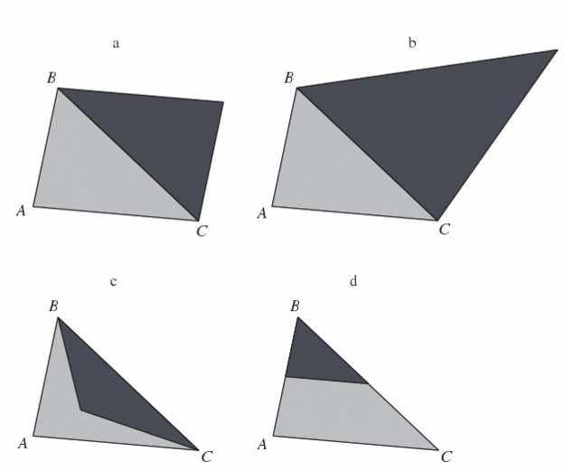
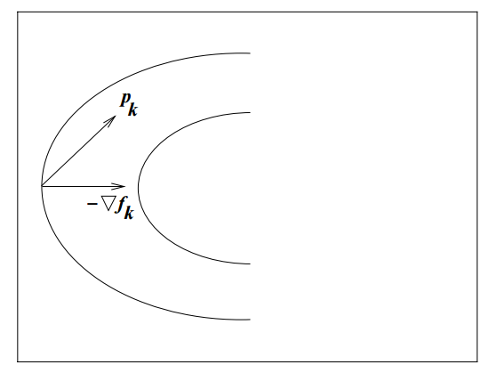
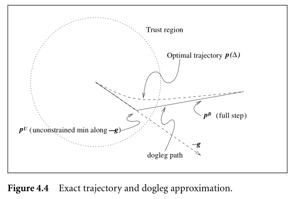
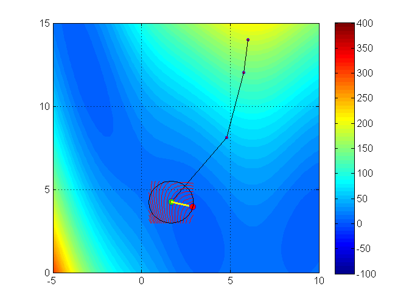

exclude: true
```{r setup}
if (!require("pacman")) install.packages("pacman")
pacman::p_load(
  xaringanthemer, JuliaCall
)

#options(htmltools.dir.version = FALSE)

knitr::opts_hooks$set(fig.callout = function(options) {
  if (options$fig.callout) {
    options$echo <- FALSE
  }

  knitr::opts_chunk$set(echo = TRUE, fig.align="center")
  options
})

```

```{r xaringan-themer, include=FALSE, warning=FALSE}
library(xaringanthemer)
style_mono_accent(
  base_color = "#8E6F3E", 
  header_font_google = google_font("Josefin Sans"),
  text_font_size = "28px",
  colors = c(
    red = "#f34213",
    gold = "#CFB991",
    gray = "#C0C0C0",
    blue = "#295fbe",
    black = "#000000"
  )
)

extra_css <- list(
  ".small" = list("font-size" = "90%"),
  ".big" = list("font-size" = "125%"),
  ".footnote" = list("font-size" = "60%"), 
  ".full-width" = list(
    display = "flex",
    width   = "100%",
    flex    = "1 1 auto"
  )
)

style_extra_css(css = extra_css)

```

```{julia}
using Pkg
Pkg.activate(".")
Pkg.instantiate()
Pkg.add("Optim")
Pkg.add("Plots")
Pkg.add("LinearAlgebra")
Pkg.add("LineSearches")
```


---

## .blue[Course roadmap]

1. .gray[Intro to Scientific Computing]
2. .gray[Numerical operations and representations]
3. .gray[Systems of equations]
4. .red[Systems of equations] (Skipped)
5. **Optimization**
  1. **Unconstrained optimization** 
    a. **Theory and derivative-free methods** $\leftarrow$ .blue[You are here]
    c. Line-search and trust region methods
  2. Constrained optimization
6. Structural estimation


---

class: inverse, center, middle

.footnote[\*These slides are based on Miranda & Fackler (2002), Nocedal & Wright (2006), Judd (1998), and course materials by Ivan Rudik and Florian Oswald.]

---


## Optimization problems

Optimization problems are ubiquitous in economics. Examples?
--

- Agent behavior
  - Consumer utility maximization
  - Firm profit maximization
--

- Social planner maximizing welfare

--
- Econometrics
  - Minimization of squared errors (OLS)
  - Minimization of empirical moment functions (GMM)
  - Maximization of likelihood (MLE)
  
--

In this unit, we will review the fundamentals of optimization and cover the main algorithms in numerical optimization

---


class: inverse, center, middle

# Fundamentals of unconstrained optimization

---

## Optimization setup

We want to minimize an objective function $f(x)$

$$\min_x f(x)$$

where $x \in \mathbb{R}^n$ is a real vector with $n \ge 1$ components and $f : \mathbb{R}^n \rightarrow \mathbb{R}$ is smooth
- In unconstrained optimization, we impose no restrictions on $x$

---

## Optimization setup

We will focus on *minimization* problems

- That's because the optimization literature and programming packages usually frame optimization as minimization

But it's simple to convert minimization into maximization problem. How?

--

- Flip the sign of $f(x)$!

$$\min_x f(x) \Leftrightarrow \max_x g(x) $$
where $g(x) = -f(x)$

---

## Optimization solutions: global vs. local optima

A point $x^*$ is a **global minimizer (or optimum)** of $f$ if

$$ f(x^*) \le f(x) \;\; \forall x \in \mathbb{R}^n$$ 

Since we can't evaluate the function at infinite points, finding global optima is generally a difficult problem
- We can't be sure if the function suddenly rises between two points we evaluate
- Most algorithms can only find **local optima**


---

## Optimization solutions: global vs. local optima

A point $x^*$ is a **local minimizer (or optimum)** of $f$ if there is a neighborhood $\mathcal{N}$ of $x^*$ such that

$$ f(x^*) \le f(x) \;\; \forall x \in \mathcal{N}$$ 

- A neighborhood of $x^*$ is an open set that contains $x^*$

--

We call $x^*$ a **strict local minimizer** if $f(x^*) < f(x) \;\; \forall x \in \mathcal{N}$ 

---

## Identifying local optima

A first approach to checking whether a point is a local optimum is to evaluate the function at all points around it

But if $f$ is *smooth*, calculus makes it much easier, especially if $f$ is twice continuously differentiable
- We only need to evaluate the *gradient* $\nabla f(x^*)$ (first derivative) and the *Hessian* $\nabla^2 f(x^*)$ (second derivative)


There are four key theorems to help us<sup>*</sup>

.footnote[<sup>*</sup>See proofs in Nocedal & Wright (2006), chapter 2]


---

## Identifying local optima

#### Theorem 1: First-Order Necessary Conditions

> If $x^*$ is a local minimizer and $f$ is continuously differentiable in an open neighborhood of $x^*$, then $\nabla f(x^*) = 0$ 

--

- If $n = 1$, this means that $f^{\prime}(x^*) = 0$

--

Note that this is only a **necessary** condition

So, we can look for points where the first derivative is zero (with rootfinding)

But, once we find them, we can't be sure yet if these points indeed are local minimizers

---

## Identifying local optima

#### Theorem 2: Second-Order Necessary Conditions

> If $x^*$ is a local minimizer of $f$ and $\nabla^2 f$ exists and is continuously differentiable in an open neighborhood of $x^*$, then $\nabla f(x^*) = 0$ and $\nabla^2 f(x^*)$ is positive semidefinite

--

- If $n = 1$, this means that $f^{\prime \prime}(x^*) \geq 0$, i.e., the function is locally convex
  - Positive semidefiniteness is the multidimensional analogous of convexity in 1D
  - A matrix $B$ is positive semidefinite if $p^\prime B p \geq 0$ for all $p$
--
  
- For maximization problems, we check whether $\nabla^2 f(x^*)$ is negative semidefinite
  

---

## Identifying local optima

#### Theorem 3: Second-Order Sufficient Conditions

> Suppose $\nabla^2 f$ is continuous in an open neighborhood of $x^*$ and that $\nabla f(x^*) = 0$ and $\nabla^2 f$ is positive definite. Then $x^*$ is a strict local minimizer of $f$

--

- Note that these are *sufficient* conditions, not necessary conditions
  - For example, $f(x) = x^4$ has a local minimizer at $x^* = 0$. But this point does not satisfy the 2nd-order sufficient conditions


---

## Conditions for global optima

Another theorem can help us characterize global optima

#### Theorem 4: Second-Order Sufficient Conditions for Global Optima

> When $f$ is convex, any local maximizer $x^*$ is a global minimizer of $f$. If in addition $f$ is differentiable, then any point $x^*$ at which $\nabla f(x^*) = 0$ is a global minimizer of $f$

- If the function is globally convex, any local minimizer we find is also a global minimizer


---


class: inverse, center, middle

# Optimization algorithms

---

## Optimization algorithms


Optimization problems have many similarities to problems we've already seen in the course
- FOCs of an unconstrained optimization problem are similar to a rootfinding problem
- FOCs of a constrained optimization problem are similar to a complementarity problem

---

## Optimization algorithms

We typically want to find a global optimum of our objective function $f$

Typically, analytic problems are set up to have a unique minimum so any local solver can generally find the global optimum
- But many problems in Economics don't satisfy the typical sufficiency conditions for a unique minimum (strictly decreasing and convex), such as
  - Games with multiple equilibria
  - Concave state transitions
  - Certain types of estimation procedures


---

## Optimization algorithms


We make two initial distinctions between **solvers** (i.e., optimization algorithms):

- **Local vs global:** are we finding an optimum in a local region, or globally?
  - Most solvers search local optima

--

- **Derivative-using vs derivative-free:** do we want to use higher-order information?

--


In this course, we'll focus on local solvers
- Global solvers are usually stochastic or subdivide the search space and apply local solvers
- Common global solvers: genetic algorithms, simulated annealing, DIRECT, and Sto-go

---

## Optimization algorithms


How do we find a local minimum?

Do we need to evaluate every single point?

--

Optimization algorithms typically have the following set up:

1. Start at some $x_0$
2. Work through a series of iterates $\{x^{(k)}\}_{k=1}^\infty$ until it "converges" with sufficient accuracy

--

If the function is smooth, we can take advantage of that information
about the function's shape to figure out which direction to move in next


---


## Solution strategies: line search vs. trust region


When we move from $x^{(k)}$ to the next iteration, $x^{(k+1)}$, we have to decide
- Which direction from $x^{(k)}$
- How far to go from $x^{(k)}$

--

There are two fundamental solution strategies that differ in the order of those decisions
- **Line search** methods first choose a *direction* and then select the optimal *step size*
--

- **Trust region** methods first choose a *step size* and then select the optimal *direction*

--

We'll see the details of each strategy later. Let's start with two relatively simple, derivative-free methods

---

## Derivative-free optimization: Golden search

Similar to bisection, **golden search** looks for a solution of a one-dimensional problem over smaller and smaller brackets

--

We have a continuous one dimensional function, $f(x)$, and we want to find a local minimum in some interval $[a,b]$

---

## Derivative-free optimization: Golden search

1. Select points $x_1,x_2 \in [a,b]$ where $x_2 > x_1$
2. Compare $f(x_1)$ and $f(x_2)$
  - If $f(x_1) < f(x_2)$, replace $[a,b]$ with $[a,x_2]$
  - Else, replace $[a,b]$ with $[x_1,b]$
3. Repeat until a convergence criterion is met

--

Replace the endpoint of the interval next to the evaluated point with the highest value 

$\rightarrow$ keep the lower evaluated point in the interval 

$\rightarrow$ guarantees that a local minimum still exists

---

## Derivative-free optimization: Golden search

How do we pick $x_1$ and $x_2$?

--

Achievable goal for selection process:
- New interval is independent of whether the upper or lower bound is replaced
- Only requires one function evaluation per iteration

--

There's one algorithm that satisfies this

---

## Derivative-free optimization: Golden search

Golden search algorithm for point selection:

\begin{gather}
	x_i = a + \alpha_i (b-a) \notag \\
	\alpha_1 = \frac{3-\sqrt{5}}{2}, \qquad \alpha_2 = \frac{\sqrt{5} - 1}{2}
\end{gather}

--

The value of $\alpha_2$ is called the golden ratio, from where the algorithm gets its name

---

## .blue[Golden search in Julia]

.blue[Write out a function to perform the golden search algorithm] `golden_search(f, lower_bound, upper_bound)`, then use it to find the minimizer of $f(x) = 2x^2 - 4x$ between -4 and 4.

Steps:
1. Calculate points $x_1,x_2 \in [a,b]$
  - $x_1 = a + \frac{3-\sqrt{5}}{2} (b-a)$ and $x_2 = a + \frac{\sqrt{5} - 1}{2} (b-a)$
2. Compare $f(x_1)$ and $f(x_2)$
  - If $f(x_1) < f(x_2)$, replace $[a,b]$ with $[a,x_2]$
  - Else, replace $[a,b]$ with $[x_1,b]$
3. Repeat until a convergence criterion is met


---

## Golden search in Julia


```
function golden_search(f, lower_bound, upper_bound)
    alpha_1 = (3 - sqrt(5))/2  # GS parameter 1
    alpha_2 = (sqrt(5) - 1)/2  # GS parameter 2
    tolerance = 1e-2           # tolerance for convergence
    difference = 1e10
    while difference > tolerance
        x_1 = lower_bound + alpha_1*(upper_bound - lower_bound)  # new x_1
        x_2 = lower_bound + alpha_2*(upper_bound - lower_bound)  # new x_2
        if f(x_1) < f(x_2)  # update bounds
            # <YOUR CODE HERE>
        else
            # <YOUR CODE HERE>
        end
        difference = x_2 - x_1
    end
    println("Minimum is at x = $((lower_bound+upper_bound)/2).")
end;
```

---

<!-- 
## Golden search in Julia


```{julia}
function golden_search(f, lower_bound, upper_bound)
    alpha_1 = (3 - sqrt(5))/2  # GS parameter 1
    alpha_2 = (sqrt(5) - 1)/2  # GS parameter 2
    tolerance = 1e-2           # tolerance for convergence
    difference = 1e10
    while difference > tolerance
        x_1 = lower_bound + alpha_1*(upper_bound - lower_bound)  # new x_1
        x_2 = lower_bound + alpha_2*(upper_bound - lower_bound)  # new x_2
        if f(x_1) < f(x_2)     # reset bounds
            upper_bound = x_2
        else
            lower_bound = x_1
        end
        difference = x_2 - x_1
    end
    println("Minimum is at x = $((lower_bound+upper_bound)/2).")
end;
```


---
-->

## Golden search in Julia

```{julia}
f(x) = 2x^2 - 4x;
golden_search(f, -4, 4)
```

---

## Golden search in Julia

<div align="center">
  <image src="figures/golden_search.gif">
</div>

---

## Derivative-free optimization: Nelder-Mead

Golden search is nice and simple but only works in one dimension

There are several derivative free methods for minimization that work in multiple dimensions. The most commonly used one is the **Nelder-Mead** (NM) algorithm

--

NM works by first constructing a simplex: we evaluate the function at $n+1$ points in an $n$ dimensional problem

It then manipulates the highest value point, similar to golden search

---

## Derivative-free optimization: Nelder-Mead

There are six operations:

--

- **Order:** order the value at the vertices of the simplex $f(x_1)\leq \dots \leq f(x_{n+1})$
--

- **Centroid:** calculate $x_0$, the centroid of the non - $x_{n+1}$ points

---

## Derivative-free optimization: Nelder-Mead

<div style="float:right">
  <image src="figures/nelder-mead_a.png" height=400>
</div>

- (a) **Reflection**: reflect $x_{n+1}$ through the opposite face of the simplex and evaluate the new point: $x_r = x_0 + \alpha(x_0 - x_{n+1})$, $\alpha > 0$
  - If this improves upon the second-highest but is not the lowest value point, replace $x_{n+1}$ with $x_r$ and restart
  - If this is the lowest value point so far, **expand**
  - If $f(x_r) > f(x_n)$, **contract**

---

## Derivative-free optimization: Nelder-Mead

<div style="float:right">
  <image src="figures/nelder-mead_c.png" height=400>
</div>

- (b) **Expansion:** push the reflected point further in the same direction

- (c) **Contraction:** Contract the highest value point toward the middle
  - Compute $x_c = x_0 + \gamma(x_0 - x_{n+1})$, $0 < \gamma \leq 0.5$
  - If $x_c$ is better than the worst point, replace $x_{n+1}$ with $x_c$ and restart
  - Else, **shrink**

---

## Derivative-free optimization: Nelder-Mead

<div style="float:right">
  
</div>

- (d) **Shrinkage:** shrink the simplex toward the best point
  - Replace all points but the best one with $x_i = x_1 + \sigma(x_i - x_1)$


---

## Nelder-Mead illustration

<div style="float:right">
  <p align="center"> a = 1, b = 100 </p>
  <image src="figures/Rosenbrock-contour.svg" height=400>
</div>


Let's see NM in action minimizing a classic function in the optimization literature: the *Rosenbrock (or banana) function*


$$f(x, y) = (a - x)^2  + b(y - x^2)^2$$

Its global minimizer is $(x, y) = (a, a^2 )$


---

## Nelder-Mead illustration

<div align="center">
  <image src="figures/Nelder-Mead_Rosenbrock.gif" height=500>
</div>


---

## Nelder-Mead in Julia

Nelder-Mead is a pain to code efficiently: don't spend the time doing it yourself!

For unconstrained optimization, Julia's most mature package is `Optim.jl`, which includes NM

--

```{julia}
using Optim;
# Define Rosenbrock function with a = 1, b = 100
f(x) = (1.0 - x[1])^2 + 100.0 * (x[2] - x[1]^2)^2; 

x0 = [0.0, 0.0]; # initial guess
```


---

## Nelder-Mead in Julia

```{julia}
soln = Optim.optimize(f, x0, NelderMead())
```

---

## Nelder-Mead in Julia

We can check the solution and the minimum value attained using

```{julia}
soln.minimizer
soln.minimum
```


---

## Nelder-Mead in Julia

If you want to check the steps, run `Optim.optimize` with option `store_trace = true`

```{julia}
soln = Optim.optimize(f, x0, NelderMead(), Optim.Options(store_trace=true));
Optim.trace(soln)
```


---

## Final comments on Nelder-Mead

- Nelder-Mead is commonly used in optmization packages but it's slow and unreliable
  - It has no real useful convergence properties

- Only use Nelder-Mead if you're solving a problem with derivatives that are costly to calculate or approximate


---

class: inverse, center, middle

# Line search algorithms

---

## Line search algorithms

General idea:

1. Start at some current iterate $x_k$
2. Select a direction to move in $p_k$
3. Figure out how far along $p_k$ to move


---

## Line search algorithms

How do we figure out how far to move?

--

"Approximately" solve this problem to figure out the **step length** $\alpha$
$$\min_{\alpha > 0} f(x_k + \alpha p_k)$$

--

We are finding the distance to move ( $\alpha$) along direction $p_k$ that minimizes our objective $f$

--

Typically, algorithms do not perform the full minimization problem since it is costly

- We only try a limited number of step lengths and stop when an approximation criterion is met (ex: Armijo, Wolfe, or Goldstein conditions)

---

## Line search: step length selection

Typical line search algorithms select the step length in two stages

1. Bracketing: pick an interval with desirable step lengths
2. Bisection or interpolation: find a "good" step length in this interval

---

## Line search: step length selection

A widely-used method is the **Backtracking** procedure

1. Choose $\bar{\alpha} > 0, \rho \in (0,1), c\in(0,1)$
2. Set $\alpha \leftarrow \bar{\alpha}$
3. Repeat until $f(x_k + \alpha p_k) \leq f(x_k) + c\alpha\nabla f_k^T p_k$
  - $\alpha \leftarrow \rho \alpha$
4. Terminate with $\alpha_k = \alpha$

--

- Step 3 checks the *Armijo condition*, which checks for a *sufficient decrease* for convergence

.footnote[*Several other step lenght methods exist. See Nocedal & Wright Ch.3 and Miranda & Fackler Ch 4.4 for more examples.]

---

## Line search: direction choice


**We still haven't answered, what direction $p_k$ do we decide to move in?**

What's an obvious choice for $p_k$?

--

The direction that yields the *steepest descent*

--

$-\nabla f_k$ is the direction that makes $f$ decrease most rapidly
 - $k$ indicates we are evaluating $f$ at iteration $k$

---

## Steepest descent method


<div align="center">
  
</div>
s

---

## Steepest descent method

We can verify this is the direction of steepest descent by referring to Taylor's theorem

--

For any direction $p$ and step length $\alpha$, we have that
$$f(x_k + \alpha p) = f(x_k) + \alpha\,p^T\,\nabla\,f_k + \frac{1}{2!}\,\alpha^2p^T\,\nabla^2\,f(x_k+tp)\,p$$

--

The rate of change in $f$ along $p$ at $x_k$ $(\alpha = 0)$ is $p^T \, \nabla\,f_k$

---

## Steepest descent method

The the unit vector of quickest descent solves
$$\min_p p^T\,\nabla\,f_k \,\,\,\,\, \text{subject to:    }||p|| = 1$$


--

Re-express the objective as 

$$\min_{\theta,||p||} ||p||\,||\nabla\,f_k||cos\,\theta$$

where $\theta$ is the angle between $p$ and $\nabla\,f_k$

--

The minimum is attained when $cos\,\theta = -1$ and $p = -\frac{\nabla\,f_k}{||\nabla\,f_k||},$ so the direction of steepest descent is simply $-\nabla\,f_k$

---

## Steepest descent method

The **steepest descent method** searches along this direction at every iteration $k$

- It may select the step length $\alpha_k$ in several different ways

- A benefit of the algorithm is that we only require the gradient of the function, and no Hessian

- However it can be very slow

---

## Line search: alternative directions

We can always use search directions other than the steepest descent

--

<div style="float:right">
  
</div>

Any descent direction (i.e. one with angle strictly less than $90^\circ$ of $-\nabla\,f_k$) 
is *guaranteed* to produce a decrease in $f$ as long as the step size is sufficiently small

--

**But is $-\nabla\,f_k$ always the best search direction?**

<!-- --- -->

<!-- ## Line search: alternative directions -->

<!-- We can actually verify this with Taylor's theorem -->

<!-- -- -->

<!-- $$f(x_k + \epsilon p_k) = f(x_k) + \epsilon\,p_k^T\,\nabla\,f_k + O(\epsilon^2)$$ -->

<!-- -- -->

<!-- If $p_k$ is in a descending direction, $\theta_k$ will be of an angle such that $cos\,\theta_k < 0$ -->

<!-- This gives us -->

<!-- -- -->

<!-- $$p_k^T\,\nabla f_k = ||p_k||\,||\nabla\,f_k||cos\,\theta_k < 0$$ -->

<!-- -- -->

<!-- Therefore $f(x_k + \epsilon p_k) < f(x_k)$ for positive but sufficiently small $\epsilon$ -->

---

## Newton-Raphson method

The most important search direction is not steepest descent but **Newton's direction**

--

This direction gives rise to the Newton-Raphson Method
- This method is basically just using Newton's method to find the root of the gradient of the objective function

---

## Newton-Raphson method


Newton's direction comes out of the second order Taylor series approximation to $f(x_k + p)$
$$f(x_k + p) \approx f_k + p^T\,\nabla\,f_k + \frac{1}{2!}\,p^T\,\nabla^2f_k\,p$$

--

We find the Newton direction by selecting the vector $p$ that minimizes $f(x_k + p)$

--

This ends up being
$$p^N_k = -[\nabla^2 f_k]^{-1}\nabla f_k$$
---

## Newton-Raphson method

The algorithm is pretty much the same as in Newton's rootfinding method

1. Start with an initial guess $x_0$
2. Repeat until convergence
  - $x_{k+1} \leftarrow x_{k} - \alpha_k [\nabla^2 f_k]^{-1}\nabla f_k$
      - where $\alpha_k$ comes from a step length selection algorithm
3. Terminate with $x^* = x_{k}$

--

- Most packages just use $\alpha=1$ (i.e., Newton's method step). But you can usually change this parameter if you have convergence issues

---

## Newton-Raphson method

This approximation to the function we are trying to solve has error of $O(||p||^3)$,
so if $p$ is small, the quadratic approximation is very accurate

--

**Drawbacks:** 
- The Newton direction is only guaranteed to decrease the objective function if $\nabla^2 f_k$ is positive definite
- It requires explicit computation of the Hessian, $\nabla^2 f(x)$
  - But quasi-Newton solvers also exist

---

## Quasi-Newton methods

Just like in rootfinding, there are several methods to avoid computing derivatives (Hessians, in this case)

Instead of the true Hessian $\nabla^2 f(x)$, these methods use an approximation $B_k$ (to the inverse of the Hessian). Hence, they set direction

$$d_k = -B_k \nabla f_k$$

--

The optimization method analogous to Broyden's that also uses the *secant condition* is the **BFGS method**
- Named after its inventors, Broyden, Fletcher, Goldfarb, Shanno

---

## Linear search methods in Julia

Once again, we will use `Optim.jl`. We'll see an example with an easy function, solving it using Steepest Descent, Newton-Raphson, and BFGS

$$f(x_1, x_2) = ax_1^2 + bx_2^2 + cx_1 + dx_2 + ex_1 x_2$$

We will use parameters $a=1, b=4, c=-2, d=-1, e=-3$

```{julia}
using Optim, Plots, LinearAlgebra;
a = 1; b = 4; c = -2; d = -1; e = -3;
f(x) = a*x[1]^2 + b*x[2]^2 + c*x[1] + d*x[2] + e*x[1]*x[2];
```

---

## Linear search methods in Julia

Let's take a look at our function with a contour plot

```{julia, include=F}
curve_levels = exp.(0:log(1.2):log(500)) .- 5; # Define manual, log-scale levels for a nicer look
```

```{julia, echo=FALSE}
Plots.contour(-5.0:0.1:10.0, -5:0.1:10.0, (x,y)->f([x, y]), fill = true, levels = curve_levels, size = (400, 300))
```


---

## Linear search methods in Julia

Since we will use Newton-Raphson, we should define the gradient and the Hessian of our function
```{julia}
# Gradient
function g!(G, x)
    G[1] = 2a*x[1] + c + e*x[2]
    G[2] = 2b*x[2] + d + e*x[1]
end;

# Hessian
function h!(H, x)
    H[1,1] = 2a
    H[1,2] = e
    H[2,1] = e
    H[2,2] = 2b
end;
```


---

## Linear search methods in Julia

Let's check if the Hessian satisfies it being positive semidefinite. One way is to check whether all eigenvalues are positive. In this case, $H$ is constant, so it's easy to check

```{julia}
H = zeros(2,2);
h!(H, [0 0]);
LinearAlgebra.eigen(H).values
```


---

## Linear search methods in Julia

Since the gradient is linear, it is also easy to calculate the minimizer analytically. The FOC is just a linear equation

```{julia}
analytic_x_star = [2a e; e 2b]\[-c ;-d]
```

---

## Linear search methods in Julia

Let's solve it with the Steepest (or Gradient) descent method

```{julia}
# Initial guess
x0 = [0.2, 1.6]; 
res_GD = Optim.optimize(f, g!, x0, GradientDescent(), Optim.Options(x_abstol=1e-3))
```

---

## Linear search methods in Julia

Let's solve it with the Steepest (or Gradient) descent method
```{julia}
res_GD.minimizer
res_GD.minimum
```


---

## Linear search methods in Julia

<div align="center">
 <image src="figures/Optim_GD.png">
</div>

---

## Linear search methods in Julia

We haven't really specified a line search method yet 

In most cases, `Optim.jl` will use by default the *Hager-Zhang method*
- This is based on Wolfe conditions

--

But we can specify other approaches. We need the `LineSearches` package to do that:

```{julia}
using LineSearches;
```

--

Let's re-run the `GradientDescent` method using $\bar{\alpha}=1$ and the backtracking method

---

## Linear search methods in Julia

```{julia}
Optim.optimize(f, g!, x0,
               GradientDescent(alphaguess = LineSearches.InitialStatic(alpha=1.0),
                               linesearch = BackTracking()),
               Optim.Options(x_abstol=1e-3))
```

---

## Linear search methods in Julia

<div align="center">
 <image src="figures/Optim_GDBT.png">
</div>

---

## Linear search methods in Julia

Next, let's use the Newton-Raphson method with default (omitted) line search parameters
- If you omit `g!` and `h!`, `Optim` will approximate them numerically for you. You can also specify options to use auto differentiation

```{julia}
Optim.optimize(f, g!, h!, x0, Newton())
```

---

## Linear search methods in Julia

<div align="center">
 <image src="figures/Optim_NR.png">
</div>

---

## Linear search methods in Julia

Lastly, let's use the BFGS method

```{julia}
Optim.optimize(f, x0, BFGS())
```

---

## Linear search methods in Julia

<div align="center">
 <image src="figures/Optim_BFGS.png">
</div>

---


class: inverse, center, middle

# Trust regions algorithms

---

## Trust region methods

Trust region methods construct an approximating model, $m_k$
whose behavior near the current iterate $x_k$ is close to that of the actual function $f$


<div align="center">
 <image src="figures/trust_region_shape.png", height=300>
</div>


We then search for a minimizer of $m_k$


---

## Trust region methods

**Issue:** $m_k$ may not represent $f$ well when far away from the current iterate $x_k$

--

**Solution:** Restrict the search for a minimizer to be within some region of $x_k$, called a **trust region**


.footnote[We are only going to cover the basic of trust region methods. For details, see Nocedal & Wright (2006), Chapter 4.]

---

## Trust region methods

Trust region problems can be formulated as
$$\min_p m_k(x_k + p)$$
where $x_k+p \in \Gamma$
- $\Gamma$ is a ball defined by $||p||_2 \leq \Delta_k$
- $\Delta_k$ is called the trust region radius

--

$\Delta_k$ is adjusted every iteration based on how well $m_k$ approximates $f_k$ around current guess $x_k$

---

## Trust region methods

<div style="float:right">
  
</div>

Typically the approximating model $m_k$ is a quadratic function (i.e. a second-order Taylor approximation)

$$m_k(x_k + p) = f_k + p^T\,\nabla\,f_k + \frac{1}{2!}\,p^T\,B_k\,p$$

where $B_k$ is the Hessian or an approximation to the Hessian

--

Solving this problem usually involves finding the *Cauchy point*

---

## Trust region methods

<div style="float:right">
  
</div>


From $x_k$, the Cauchy point can be found in the direction 

$$p^C_k = -\tau_k \frac{\Delta_k}{||\nabla f_k||} \nabla f_k$$
So it's kind of a gradient descent ( $-\nabla f_k$), but with an adjusted step size within the trust region.
--

The step size depends on the radius $\Delta_k$ and parameter $\tau_k$


\begin{gather}
  \tau_k = \begin{cases}
    1 & \text{if} \; \nabla f_k^T B_k \nabla f_k \leq 0\\
    \min(||\nabla f_k||^3/\Delta_k \nabla f_k^T B_k \nabla f_k, 1) & \text{otherwise}
  \end{cases}
\end{gather}


---

## Trust region methods

If you ran `nlsolve` with default parameters, you may have noticed it uses `Trust region with dogleg`. What's the deal with the `dogleg`?

--

<div style="float:right">
  
</div>

It's an improvement on the Cauchy point method
- It allows us to move in V-shaped trajectory instead of slowly adjusting with Cauchy directions along a curved path

---

## Trust region method illustration

Let's see an illustration of the trust region method with the Branin function (it has 3 global minimizers)<sup>*</sup>

$$min f(x_1, x_2) = (x_2 - 0.129x_1^2 + 1.6 x_1 - 6)^2 + 6.07 \cos(x_1) + 10$$

.footnote[* Source for this example: https://optimization.mccormick.northwestern.edu/index.php/Trust-region_methods]


---

## Trust region method illustration

Contour plot

<div align="center">
  
</div>


---

## Trust region method illustration

Iteration 1

<div align="center">
  
</div>

---

## Trust region method illustration

Iteration 2

<div align="center">
  
</div>

---

## Trust region method illustration

Iteration 3

<div align="center">
  
</div>

---

## Trust region method illustration

Iteration 4

<div align="center">
  
</div>


---

## Trust region method illustration

Iteration 5

<div align="center">
  
</div>


---

## Trust region method illustration

Iteration 6

<div align="center">
  
</div>

---

## Trust region method illustration

Full trajectory

<div align="center">
  
</div>


---

## Trust region methods in Julia

`Optim` includes a `NewtonTrustRegion()` solution method. To use it, you can call `optimize` just like you did with `Newton()`

--

.blue[Your turn: use `Optim` and `NewtonTrustRegion` to solve the quadratic function illustrated in the line search methods (slide 57).]

- Use default parameters. You can tweak solver parameters later by checking out the documentation [https://julianlsolvers.github.io/Optim.jl/stable/#algo/newton_trust_region/](https://julianlsolvers.github.io/Optim.jl/stable/#algo/newton_trust_region/)


---

## Trust region methods in Julia


```{julia}
Optim.optimize(f, g!, h!, x0, NewtonTrustRegion())
```

---

## Trust region methods in Julia

<div align="center">
 <image src="figures/Optim_NTR.png">
</div>