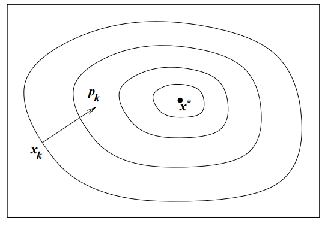
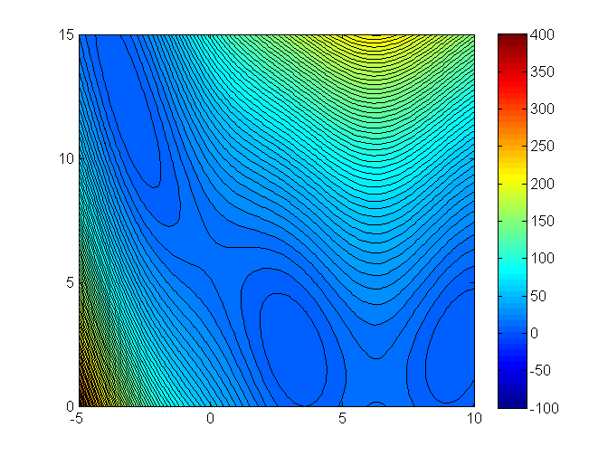

exclude: true
```{r setup}
if (!require("pacman")) install.packages("pacman")
pacman::p_load(
  xaringanthemer, JuliaCall
)

#options(htmltools.dir.version = FALSE)

knitr::opts_hooks$set(fig.callout = function(options) {
  if (options$fig.callout) {
    options$echo <- FALSE
  }

  knitr::opts_chunk$set(echo = TRUE, fig.align="center")
  options
})

```

```{r xaringan-themer, include=FALSE, warning=FALSE}
library(xaringanthemer)
style_mono_accent(
  base_color = "#8E6F3E", 
  header_font_google = google_font("Josefin Sans"),
  text_font_size = "28px",
  colors = c(
    red = "#f34213",
    gold = "#CFB991",
    gray = "#C0C0C0",
    blue = "#295fbe",
    black = "#000000"
  )
)

extra_css <- list(
  ".small" = list("font-size" = "90%"),
  ".big" = list("font-size" = "125%"),
  ".footnote" = list("font-size" = "60%"), 
  ".full-width" = list(
    display = "flex",
    width   = "100%",
    flex    = "1 1 auto"
  )
)

style_extra_css(css = extra_css)

```

```{julia}
using Pkg
Pkg.activate(".")
Pkg.instantiate()
Pkg.add("Optim")
Pkg.add("Plots")
Pkg.add("LinearAlgebra")
Pkg.add("LineSearches")
```


---

## .blue[Course roadmap]

1. .gray[Intro to Scientific Computing]
2. .gray[Numerical operations and representations]
3. .gray[Systems of equations]
4. .gray[Function approximation (Skipped)]
5. **Optimization**
  - 5.1 **Unconstrained optimization** 
      - A) Theory and derivative-free methods
      - B) **Line-search and trust region methods** $\leftarrow$ *You are here*
  - 5.2 Constrained optimization
6. Structural estimation


---

class: inverse, center, middle

.footnote[\*These slides are based on Miranda & Fackler (2002), Nocedal & Wright (2006), Judd (1998), and course materials by Ivan Rudik and Florian Oswald.]

---


## Solution strategies: line search vs. trust region


When we move from $x^{(k)}$ to the next iteration, $x^{(k+1)}$, we have to decide
- Which direction from $x^{(k)}$
- How far to go from $x^{(k)}$

--

There are two fundamental solution strategies that differ in the order of those decisions
- **Line search** methods first choose a *direction* and then select the optimal *step size*
--

- **Trust region** methods first choose a *step size* and then select the optimal *direction*

---


class: inverse, center, middle

# Line search algorithms

---

## Line search algorithms

General idea:

1. Start at some current iterate $x_k$
2. Select a direction to move in $p_k$
3. Figure out how far along $p_k$ to move


---

## Line search algorithms

How do we figure out how far to move?

--

"Approximately" solve this problem to figure out the **step length** $\alpha$
$$\min_{\alpha > 0} f(x_k + \alpha p_k)$$

--

We are finding the distance to move ( $\alpha$) along direction $p_k$ that minimizes our objective $f$

--

Typically, algorithms do not perform the full minimization problem since it is costly

- We only try a limited number of step lengths and stop when an approximation criterion is met (ex: Armijo, Wolfe, or Goldstein conditions)

---

## Line search: step length selection

Typical line search algorithms select the step length in two stages

1. Bracketing: pick an interval with desirable step lengths
2. Bisection or interpolation: find a "good" step length in this interval

---

## Line search: step length selection

A widely-used method is the **Backtracking** procedure

1. Choose $\bar{\alpha} > 0, \rho \in (0,1), c\in(0,1)$
2. Set $\alpha \leftarrow \bar{\alpha}$
3. Repeat until $f(x_k + \alpha p_k) \leq f(x_k) + c\alpha\nabla f_k^T p_k$
  - $\alpha \leftarrow \rho \alpha$
4. Terminate with $\alpha_k = \alpha$

--

- Step 3 checks the *Armijo condition*, which checks for a *sufficient decrease* for convergence

.footnote[*Several other step lenght methods exist. See Nocedal & Wright Ch.3 and Miranda & Fackler Ch 4.4 for more examples.]

---

## Line search: direction choice


**We still haven't answered, what direction $p_k$ do we decide to move in?**

What's an obvious choice for $p_k$?

--

The direction that yields the *steepest descent*

--

$-\nabla f_k$ is the direction that makes $f$ decrease most rapidly
 - $k$ indicates we are evaluating $f$ at iteration $k$

---

## Steepest descent method


<div align="center">
  
</div>
s

---

## Steepest descent method

We can verify this is the direction of steepest descent by referring to Taylor's theorem

--

For any direction $p$ and step length $\alpha$, we have that
$$f(x_k + \alpha p) = f(x_k) + \alpha\,p^T\,\nabla\,f_k + \frac{1}{2!}\,\alpha^2p^T\,\nabla^2\,f(x_k+tp)\,p$$

--

The rate of change in $f$ along $p$ at $x_k$ $(\alpha = 0)$ is $p^T \, \nabla\,f_k$

---

## Steepest descent method

The the unit vector of quickest descent solves
$$\min_p p^T\,\nabla\,f_k \,\,\,\,\, \text{subject to:    }||p|| = 1$$


--

Re-express the objective as 

$$\min_{\theta,||p||} ||p||\,||\nabla\,f_k||cos\,\theta$$

where $\theta$ is the angle between $p$ and $\nabla\,f_k$

--

The minimum is attained when $cos\,\theta = -1$ and $p = -\frac{\nabla\,f_k}{||\nabla\,f_k||},$ so the direction of steepest descent is simply $-\nabla\,f_k$

---

## Steepest descent method

The **steepest descent method** searches along this direction at every iteration $k$

- It may select the step length $\alpha_k$ in several different ways

- A benefit of the algorithm is that we only require the gradient of the function, and no Hessian

- However it can be very slow

---

## Line search: alternative directions

We can always use search directions other than the steepest descent

--

<div style="float:right">
  
</div>

Any descent direction (i.e. one with angle strictly less than $90^\circ$ of $-\nabla\,f_k$) 
is *guaranteed* to produce a decrease in $f$ as long as the step size is sufficiently small

--

**But is $-\nabla\,f_k$ always the best search direction?**

<!-- --- -->

<!-- ## Line search: alternative directions -->

<!-- We can actually verify this with Taylor's theorem -->

<!-- -- -->

<!-- $$f(x_k + \epsilon p_k) = f(x_k) + \epsilon\,p_k^T\,\nabla\,f_k + O(\epsilon^2)$$ -->

<!-- -- -->

<!-- If $p_k$ is in a descending direction, $\theta_k$ will be of an angle such that $cos\,\theta_k < 0$ -->

<!-- This gives us -->

<!-- -- -->

<!-- $$p_k^T\,\nabla f_k = ||p_k||\,||\nabla\,f_k||cos\,\theta_k < 0$$ -->

<!-- -- -->

<!-- Therefore $f(x_k + \epsilon p_k) < f(x_k)$ for positive but sufficiently small $\epsilon$ -->

---

## Newton-Raphson method

The most important search direction is not steepest descent but **Newton's direction**

--

This direction gives rise to the Newton-Raphson Method
- This method is basically just using Newton's method to find the root of the gradient of the objective function

---

## Newton-Raphson method


Newton's direction comes out of the second order Taylor series approximation to $f(x_k + p)$
$$f(x_k + p) \approx f_k + p^T\,\nabla\,f_k + \frac{1}{2!}\,p^T\,\nabla^2f_k\,p$$

--

We find the Newton direction by selecting the vector $p$ that minimizes $f(x_k + p)$

--

This ends up being
$$p^N_k = -[\nabla^2 f_k]^{-1}\nabla f_k$$
---

## Newton-Raphson method

The algorithm is pretty much the same as in Newton's rootfinding method

1. Start with an initial guess $x_0$
2. Repeat until convergence
  - $x_{k+1} \leftarrow x_{k} - \alpha_k [\nabla^2 f_k]^{-1}\nabla f_k$
      - where $\alpha_k$ comes from a step length selection algorithm
3. Terminate with $x^* = x_{k}$

--

- Most packages just use $\alpha=1$ (i.e., Newton's method step). But you can usually change this parameter if you have convergence issues

---

## Newton-Raphson method

This approximation to the function we are trying to solve has error of $O(||p||^3)$,
so if $p$ is small, the quadratic approximation is very accurate

--

**Drawbacks:** 
- The Newton direction is only guaranteed to decrease the objective function if $\nabla^2 f_k$ is positive definite
- It requires explicit computation of the Hessian, $\nabla^2 f(x)$
  - But quasi-Newton solvers also exist

---

## Quasi-Newton methods

Just like in rootfinding, there are several methods to avoid computing derivatives (Hessians, in this case)

Instead of the true Hessian $\nabla^2 f(x)$, these methods use an approximation $B_k$ (to the inverse of the Hessian). Hence, they set direction

$$d_k = -B_k \nabla f_k$$

--

The optimization method analogous to Broyden's that also uses the *secant condition* is the **BFGS method**
- Named after its inventors, Broyden, Fletcher, Goldfarb, Shanno

---

## Linear search methods in Julia

Once again, we will use `Optim.jl`. We'll see an example with an easy function, solving it using Steepest Descent, Newton-Raphson, and BFGS

$$f(x_1, x_2) = ax_1^2 + bx_2^2 + cx_1 + dx_2 + ex_1 x_2$$

We will use parameters $a=1, b=4, c=-2, d=-1, e=-3$

```{julia}
using Optim, Plots, LinearAlgebra;
a = 1; b = 4; c = -2; d = -1; e = -3;
f(x) = a*x[1]^2 + b*x[2]^2 + c*x[1] + d*x[2] + e*x[1]*x[2];
```

---

## Linear search methods in Julia

Let's take a look at our function with a contour plot

```{julia, include=F}
curve_levels = exp.(0:log(1.2):log(500)) .- 5; # Define manual, log-scale levels for a nicer look
```

```{julia, echo=FALSE}
Plots.contour(-5.0:0.1:10.0, -5:0.1:10.0, (x,y)->f([x, y]), fill = true, levels = curve_levels, size = (400, 300))
```


---

## Linear search methods in Julia

Since we will use Newton-Raphson, we should define the gradient and the Hessian of our function
```{julia}
# Gradient
function g!(G, x)
    G[1] = 2a*x[1] + c + e*x[2]
    G[2] = 2b*x[2] + d + e*x[1]
end;

# Hessian
function h!(H, x)
    H[1,1] = 2a
    H[1,2] = e
    H[2,1] = e
    H[2,2] = 2b
end;
```


---

## Linear search methods in Julia

Let's check if the Hessian satisfies it being positive semidefinite. One way is to check whether all eigenvalues are positive. In this case, $H$ is constant, so it's easy to check

```{julia}
H = zeros(2,2);
h!(H, [0 0]);
LinearAlgebra.eigen(H).values
```


---

## Linear search methods in Julia

Since the gradient is linear, it is also easy to calculate the minimizer analytically. The FOC is just a linear equation

```{julia}
analytic_x_star = [2a e; e 2b]\[-c ;-d]
```

---

## Linear search methods in Julia

Let's solve it with the Steepest (or Gradient) descent method

```{julia}
# Initial guess
x0 = [0.2, 1.6]; 
res_GD = Optim.optimize(f, g!, x0, GradientDescent(), Optim.Options(x_abstol=1e-3))
```

---

## Linear search methods in Julia

Let's solve it with the Steepest (or Gradient) descent method
```{julia}
res_GD.minimizer
res_GD.minimum
```


---

## Linear search methods in Julia

<div align="center">
 <image src="figures/Optim_GD.png">
</div>

---

## Linear search methods in Julia

We haven't really specified a line search method yet 

In most cases, `Optim.jl` will use by default the *Hager-Zhang method*
- This is based on Wolfe conditions

--

But we can specify other approaches. We need the `LineSearches` package to do that:

```{julia}
using LineSearches;
```

--

Let's re-run the `GradientDescent` method using $\bar{\alpha}=1$ and the backtracking method

---

## Linear search methods in Julia

```{julia}
Optim.optimize(f, g!, x0,
               GradientDescent(alphaguess = LineSearches.InitialStatic(alpha=1.0),
                               linesearch = BackTracking()),
               Optim.Options(x_abstol=1e-3))
```

---

## Linear search methods in Julia

<div align="center">
 <image src="figures/Optim_GDBT.png">
</div>

---

## Linear search methods in Julia

Next, let's use the Newton-Raphson method with default (omitted) line search parameters
- If you omit `g!` and `h!`, `Optim` will approximate them numerically for you. You can also specify options to use auto differentiation

```{julia}
Optim.optimize(f, g!, h!, x0, Newton())
```

---

## Linear search methods in Julia

<div align="center">
 <image src="figures/Optim_NR.png">
</div>

---

## Linear search methods in Julia

Lastly, let's use the BFGS method

```{julia}
Optim.optimize(f, x0, BFGS())
```

---

## Linear search methods in Julia

<div align="center">
 <image src="figures/Optim_BFGS.png">
</div>

---


class: inverse, center, middle

# Trust regions algorithms

---

## Trust region methods

Trust region methods construct an approximating model, $m_k$
whose behavior near the current iterate $x_k$ is close to that of the actual function $f$


<div align="center">
 <image src="figures/trust_region_shape.png", height=300>
</div>


We then search for a minimizer of $m_k$


---

## Trust region methods

**Issue:** $m_k$ may not represent $f$ well when far away from the current iterate $x_k$

--

**Solution:** Restrict the search for a minimizer to be within some region of $x_k$, called a **trust region**


.footnote[We are only going to cover the basic of trust region methods. For details, see Nocedal & Wright (2006), Chapter 4.]

---

## Trust region methods

Trust region problems can be formulated as
$$\min_p m_k(x_k + p)$$
where $x_k+p \in \Gamma$
- $\Gamma$ is a ball defined by $||p||_2 \leq \Delta_k$
- $\Delta_k$ is called the trust region radius

--

$\Delta_k$ is adjusted every iteration based on how well $m_k$ approximates $f_k$ around current guess $x_k$

---

## Trust region methods

<div style="float:right">
  
</div>

Typically the approximating model $m_k$ is a quadratic function (i.e. a second-order Taylor approximation)

$$m_k(x_k + p) = f_k + p^T\,\nabla\,f_k + \frac{1}{2!}\,p^T\,B_k\,p$$

where $B_k$ is the Hessian or an approximation to the Hessian

--

Solving this problem usually involves finding the *Cauchy point*

---

## Trust region methods

<div style="float:right">
  
</div>


From $x_k$, the Cauchy point can be found in the direction 

$$p^C_k = -\tau_k \frac{\Delta_k}{||\nabla f_k||} \nabla f_k$$
So it's kind of a gradient descent ( $-\nabla f_k$), but with an adjusted step size within the trust region.
--

The step size depends on the radius $\Delta_k$ and parameter $\tau_k$


\begin{gather}
  \tau_k = \begin{cases}
    1 & \text{if} \; \nabla f_k^T B_k \nabla f_k \leq 0\\
    \min(||\nabla f_k||^3/\Delta_k \nabla f_k^T B_k \nabla f_k, 1) & \text{otherwise}
  \end{cases}
\end{gather}


---

## Trust region methods

If you ran `nlsolve` with default parameters, you may have noticed it uses `Trust region with dogleg`. What's the deal with the `dogleg`?

--

<div style="float:right">
  
</div>

It's an improvement on the Cauchy point method
- It allows us to move in V-shaped trajectory instead of slowly adjusting with Cauchy directions along a curved path

---

## Trust region method illustration

Let's see an illustration of the trust region method with the Branin function (it has 3 global minimizers)<sup>*</sup>

$$min f(x_1, x_2) = (x_2 - 0.129x_1^2 + 1.6 x_1 - 6)^2 + 6.07 \cos(x_1) + 10$$

.footnote[* Source for this example: https://optimization.mccormick.northwestern.edu/index.php/Trust-region_methods]


---

## Trust region method illustration

Contour plot

<div align="center">
  
</div>


---

## Trust region method illustration

Iteration 1

<div align="center">
  
</div>

---

## Trust region method illustration

Iteration 2

<div align="center">
  
</div>

---

## Trust region method illustration

Iteration 3

<div align="center">
  
</div>

---

## Trust region method illustration

Iteration 4

<div align="center">
  
</div>


---

## Trust region method illustration

Iteration 5

<div align="center">
  
</div>


---

## Trust region method illustration

Iteration 6

<div align="center">
  
</div>

---

## Trust region method illustration

Full trajectory

<div align="center">
  
</div>


---

## Trust region methods in Julia

`Optim` includes a `NewtonTrustRegion()` solution method. To use it, you can call `optimize` just like you did with `Newton()`

---

## .blue[Your turn: Trust region methods in Julia]


Use `Optim` and `NewtonTrustRegion`* to solve the same quadratic function from before

$$f(x_1, x_2) = ax_1^2 + bx_2^2 + cx_1 + dx_2 + ex_1 x_2$$

With parameters $a=1, b=4, c=-2, d=-1, e=-3$

```{julia, eval=F}
a = 1; b = 4; c = -2; d = -1; e = -3;
f(x) = a*x[1]^2 + b*x[2]^2 + c*x[1] + d*x[2] + e*x[1]*x[2];
# Complete the arguments of the call
Optim.optimize(<?>, <?>, <?>, <?>, <?>)
```

.footnote[*Use default parameters. You can tweak solver parameters later by checking out the documentation [https://julianlsolvers.github.io/Optim.jl/stable/#algo/newton_trust_region/](https://julianlsolvers.github.io/Optim.jl/stable/#algo/newton_trust_region/)]


---

## Trust region methods in Julia


```{julia, echo=F}
a = 1; b = 4; c = -2; d = -1; e = -3;
f(x) = a*x[1]^2 + b*x[2]^2 + c*x[1] + d*x[2] + e*x[1]*x[2];
res = Optim.optimize(f, g!, h!, x0, NewtonTrustRegion());
print(res)
```

---

## Trust region methods in Julia

<div align="center">
 <image src="figures/Optim_NTR.png">
</div>