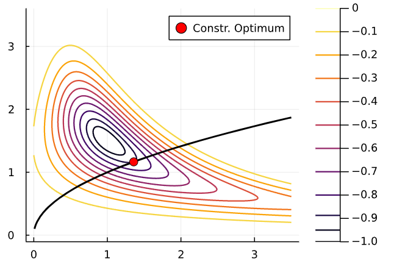
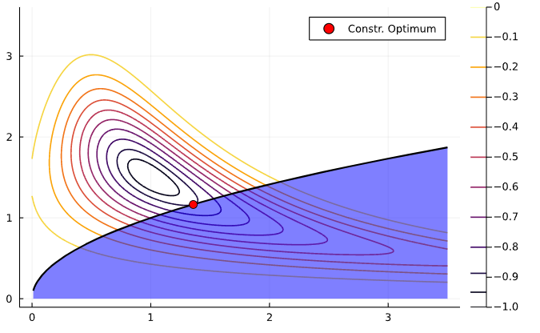
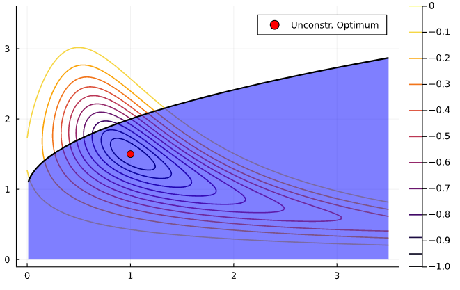
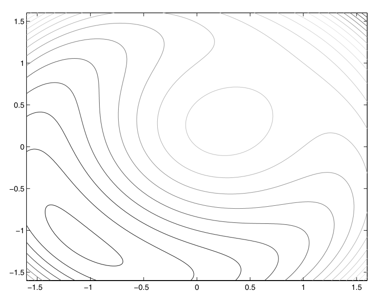
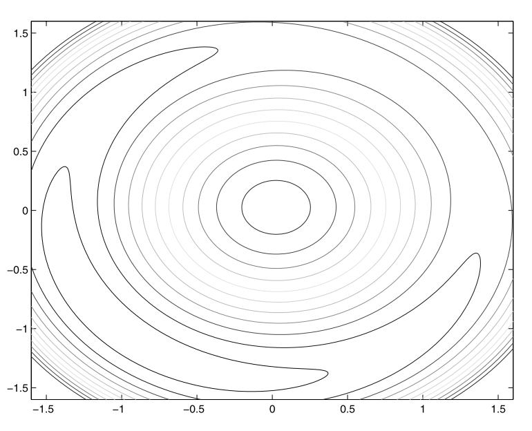

exclude: true
```{r setup}
if (!require("pacman")) install.packages("pacman")
pacman::p_load(
  xaringanthemer
)

#options(htmltools.dir.version = FALSE)

knitr::opts_hooks$set(fig.callout = function(options) {
  if (options$fig.callout) {
    options$echo <- FALSE
  }

  knitr::opts_chunk$set(echo = TRUE, fig.align="center")
  options
})

```

```{r xaringan-themer, include=FALSE, warning=FALSE}
library(xaringanthemer)
style_mono_accent(
  base_color = "#8E6F3E", 
  header_font_google = google_font("Josefin Sans"),
  text_font_size = "28px",
  colors = c(
    red = "#f34213",
    gold = "#CFB991",
    gray = "#C0C0C0",
    blue = "#295fbe",
    black = "#000000"
  )
)

extra_css <- list(
  ".small" = list("font-size" = "90%"),
  ".big" = list("font-size" = "125%"),
  ".footnote" = list("font-size" = "60%"), 
  ".full-width" = list(
    display = "flex",
    width   = "100%",
    flex    = "1 1 auto"
  )
)

style_extra_css(css = extra_css)

```

---

## .blue[Course roadmap]

1. .gray[Intro to Scientific Computing]
2. .gray[Numerical operations and representations]
3. .gray[Systems of equations]
4. .gray[Function approximation (Skipped)]
5. **Optimization**
  - .gold[5.1 Unconstrained optimization]
  - **5.2 Constrained optimization**
    - A) **Theory and solution algorithms** $\leftarrow$ *You are here*
    - B) Constrained optimization in Julia
6. Structural estimation

---

class: inverse, center, middle

.footnote[\*These slides are based on Miranda & Fackler (2002), Nocedal & Wright (2006), Judd (1998), and course materials by Ivan Rudik and Florian Oswald.]

---

## Constrained optimization setup

We want to solve 

$$\min_x f(x)$$

subject to

\begin{gather}
  g(x) = 0\\
  h(x) \leq 0
\end{gather}

where $f:\mathbb{R}^n \rightarrow \mathbb{R}$, $g:\mathbb{R}^n \rightarrow \mathbb{R}^m$, $h:\mathbb{R}^n \rightarrow \mathbb{R}^l$, and $f, g$, and $h$ are twice continuously differentiable
- We have $m$ *equality constraints* and $l$ *inequality constraints*

---

## Constraint types

Constraints come in two types: equality or inequality

Let's see a an illustration with a single constraint. Consider the optimization problem

$$
\min_x -exp\left(-(x_1 x_2 - 1.5)^2 - (x_2 - 1.5)^2 \right)
$$

subject to $x_1 - x_2^2 = 0$

- The equality constraint limits solutions along the curve where $x_1 = x_2^2$

---

## Constraint types

<div align="center">
  
</div>

---

## Constraint types

The problem can also be formulated with an inequality constraint

$$
\min_x -exp\left(-(x_1 x_2 - 1.5)^2 - (x_2 - 1.5)^2 \right)
$$

subject to $-x_1 + x_2^2 \leq 0$

--

How would that change feasible set compared to the equality constraint?

---

## Constraint types

<div style="float:right">
  
</div>

The feasible set is in blue
- It extends below and to the right

The solution in this case is along the boundaries of the feasible set
- It coincides with the equality constraint
- In those cases, we say the constraint is **binding** or **active** 

---

## Constraint types

<div style="float:right">
  
</div>

If the solution is *interior* to the feasible set, we say the constraint is **slack** or **inactive**
- The solution to the constrained optimization problem is the same as the unconstrained one

---

## Solving constrained optimization problems

You may recall from Math Econ courses that, under certain conditions, we can solve a constrained optimization problem by solving instead the corresponding *mixed complementary problem* using the first order conditions

That trick follows from the **Karush-Kuhn-Tucker (KKT) Theorem**

What does it say?

---

## Karush-Kuhn-Tucker Theorem

> If $x^*$ is a local minimizer and the constraint qualification<sup>1</sup> holds, then there are multipliers $\lambda^* \in \mathbb{R}^m$ and $\mu^* \in \mathbb{R}^l$ such that $x^*$ is a stationary point of $\mathcal{L}$, the *Lagrangian* 

.footnote[<sup>1</sup>Constraint qualification, or regularity conditions, can be formulated depending on the nature of the constraint. We tend to overlook those in Economics, though.]


$$
\mathcal{L}(x, \lambda, \mu) = f(x) + \lambda^T g(x) + \mu^T h(x)
$$

- Variables $\lambda$ and $\mu$ are called *Lagrange multipliers* and in Economics have the intepretation of shadow prices

--

How does this theorem help us?

---

## Karush-Kuhn-Tucker Theorem

Put another way, the theorem states that $\mathcal{L}_x(x^*, \lambda^*, \mu^*) = 0$

--

So, it tell us that $(x^*, \lambda^*, \mu^*)$ solve the system

\begin{gather}
  f_x + \lambda^T g_x + \mu^T h_x = 0 \\
  \mu_i h^i(x) = 0, \; i = 1, \dots, l \\
  g(x) = 0 \\
  h(x) \leq 0 \\
  \mu \leq 0
\end{gather}


- Subscripts ( $_x$) denote derivatives w.r.t. $x$ (it's a vector)
- $h^i(x)$ is the $i$-th element of $h(x)$

---

## The KKT approach

The KKT theorem gives us a first approach to solving unconstrained optimization problems

- If the problem has box constraints ( $a \leq x \leq b$), we can solve the corresponding *mixed complementarity problem* $CP(f^\prime, a, b)$ as we saw in unit 3
--

- If constraints are more elaborated and multidimensional, we need to solve a series of nonlinear systems: one for each possible combination of binding inequality constraints
  - This is probably how you learned to solve utility maximization with a budget constraint


---

## The KKT approach

Let $\mathcal{I}$ be the set of ${1, 2, ..., l}$ inequality constraints. For a subset $\mathcal{P} \in \mathcal{I}$ of, we define the $\mathcal{P}$ problem as the nonlinear system of equations

\begin{gather}
  f_x + \lambda^T g_x + \mu^T h_x = 0 \\
  h^i(x) = 0, \; i \in \mathcal{P} \\
  \mu_i = 0, \; i \in \mathcal{I} - \mathcal{P} \\
  g(x) = 0 
\end{gather}

--

We solve this system for every possible combination of binding constraints $\mathcal{P}$
- There might not be a solution for some combinations. That's OK
- Compare the solutions of all combinations and pick the optimal (where $f$ attains the smallest value, in this case)

---

## The KKT approach

When we have a good intuition about the problem, we may know ahead of time which constraints will bind
- For example, with monotonically increasing utility functions, we know the budget constraint binds

--

But as the number of constraints grows, we have an even larger number of possible combinations
- More combinations = more nonlinear systems to solve and compare

---

## Other solution approaches

The combinatorial nature of the KKT approach is not that desirable from a computational perspective
- However, if the resulting nonlinear systems are simple to solve, we may still favor KKT

There are computational alternatives to KKT. We'll discuss three types of algorithms

- Penalty methods
- Active set methods
- Interior point methods


---

class: inverse, center, middle

# Constrained optimization algorithms

---

## Penalty methods

Suppose we wish to minimize some function subject to equality constraints (easily generalizes to inequality)
$$\min_x f(x) \,\,\, \text{s. t.} \,\, g(x) = 0$$

--

How does an algorithm know to not violate the constraint?

--

One way is to introduce a **penalty function** into our objective and remove the constraint

$$Q(x;\rho) = f(x) + \rho P(g(x))$$
where $\rho$ is the penalty parameter

---

## Penalty methods


With this, we transformed it into an unconstrained optimization problem
$$\min_x Q(x; \rho) = f(x) + \rho P(g(x))$$
--

How do we pick $P$ and $\rho$?

--

A first idea is to penalize a candidate solution as much as possible whenever it leaves the feasible set: infinite penalty!

$$Q(x) = f(x) + \infty \mathbf{1}(g(x) \neq 0)$$
where $\mathbf{1}$ is an indicator function

- This is the **infinity step** method

---

## Penalty methods

However, the infinite step method is a pretty bad idea

- $Q$ becomes discontinuous and non-differentiable: it's very hard for algorithms to iterate near the region where the constraint binds
- Any really large value or $\rho$ leads to the same practical problem

--

So we might instead use a more forgiving penalty function

---

## Penalty methods

A widely-used choice is the quadratic penalty function

$$Q(x;\rho) = f(x) + \frac{\rho}{2} \sum_i g_i^2(x)$$

- For inequality constraint $h(x) \leq 0$, we can use $[\max(0, h_i(x))]^2$ 

--

The second term increases the value of the function
- bigger $\rho \rightarrow$ bigger penalty from violating the constraint

--

The penalty terms are smooth $\rightarrow$ use unconstrained optimization techniques  
to solve the problem by searching for iterates of $x_k$

---

## Penalty methods

Algorithms generally iterate on sequences of $\rho_k \rightarrow \infty$ as $k \rightarrow \infty$, to require satisfying the constraints as we close in

--

There are also *Augmented Lagrangian methods* that take the quadratic penalty method and add explicit estimates of Lagrange multipliers to help force binding constraints to bind precisely 

---

## Penalty method example

Example:
$$\min x_1 + x_2 \,\,\,\,\,\text{      subject to:    } \,\,\, x_1^2 + x_2^2 - 2 = 0$$

--

Solution is pretty easy to show to be $(-1, -1)$

--

The penalty method function $Q(x_1, x_2; \rho)$ is
$$Q(x_1, x_2; \rho) = x_1 + x_2 + \frac{\rho}{2} (x_1^2 + x_2^2 - 2)^2$$

--

Let's ramp up $\rho$ and see what happens to how the function looks

---

## Penalty method example

$\rho = 1$, solution is around $(-1.1, -1.1)$

<div align="center">
  
</div>

---

## Penalty method example

$\rho = 10$, solution is very close to $(-1, -1)$. Notice how quickly value increases outside $x_1^2 + x_2^2 = 2$ circle

<div align="center">
  
</div>


---

## Active set methods

The KKT method can lead to too many combinations of constraints to evaluate

Penalty methods don't have the same problem but still require us to evaluate every constraint, even if they are not binding

-- 

Improving on the KKT approach, **active set methods** strategically to pick a sequence of combinations of constraints

---

## Active set methods

Instead of trying all possible combinations, like in KKT, active set methods start with an initial guess of the binding constraints set

Then, iterate by periodically checking constraints
- Add or keep the ones that are active (binding)
- Drop the ones that are inactive (slack)

--

If an appropriate strategy of picking sets is chosen, active set algorithms converge to the optimal solution
  
---

## Interior point methods

Interior point methods are also called **barrier methods**

--

These are typically used for inequality constrained problems

--

The name **interior point** comes from the algorithm traversing the domain along the interior of the inequality constraints

--

**Issue:** how do we ensure we are on the interior of the feasible set?

--

**Main idea:** impose a **barrier** to stop the solver from letting a constraint bind

---

## Interior point methods

Consider the following constrained optimization problem
\begin{gather}
	\min_{x} f(x) \notag\\
	\text{subject to:  } g(x) = 0, h(x) \leq 0
\end{gather}

--

Reformulate this problem as
\begin{gather}
	\min_{x,s} f(x) \notag\\
	\text{subject to:  } g(x) = 0, h(x) + s = 0, s \geq 0
\end{gather}

where $s$ is a vector of slack variables for the constraints

---

## Interior point methods

Final step: introduce a **barrier function** to eliminate the inequality constraint,
\begin{gather}
	\min_{x,s} f(x) - \mu \sum_{i=1}^l log(s_i) \notag\\
	\text{subject to:  } g(x) = 0, h(x) + s = 0
\end{gather}

where $\mu > 0$ is a barrier parameter

---

## Interior point methods

The barrier function prevents the components of $s$ from approaching zero by imposing a logarithmic barrier $\rightarrow$ it maintains slack in the constraints
- Another common barrier function is $\sum_{i=1}^l (1/s_i)$

--

Interior point methods solve a sequence of barrier problems until $\mu_k$ converges to zero

--

The solution to the barrier problem converges to that of the original problem

