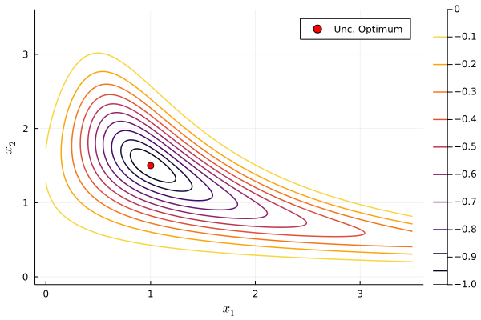
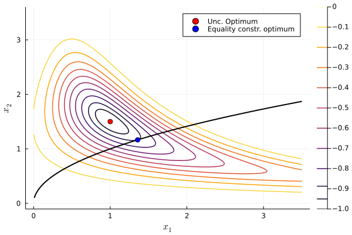
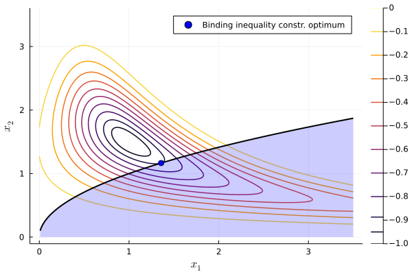
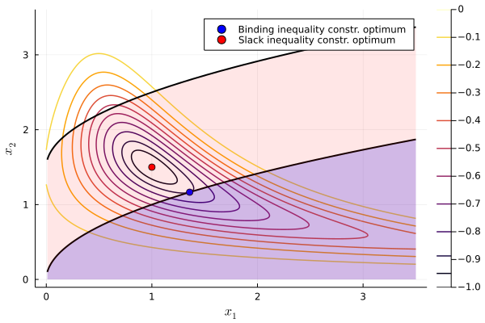
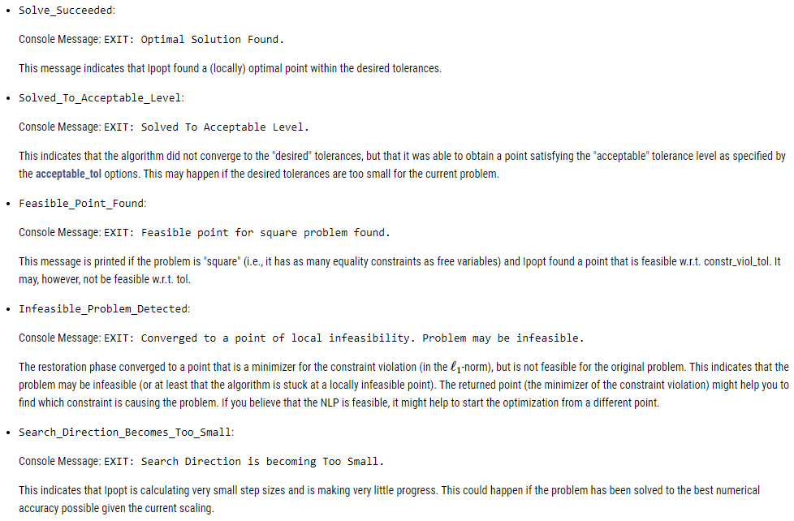
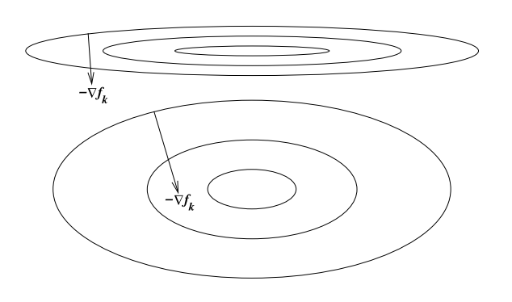

exclude: true
```{r setup}
if (!require("pacman")) install.packages("pacman")
pacman::p_load(
  xaringanthemer, JuliaCall
)

#options(htmltools.dir.version = FALSE)

knitr::opts_hooks$set(fig.callout = function(options) {
  if (options$fig.callout) {
    options$echo <- FALSE
  }

  knitr::opts_chunk$set(echo = TRUE, fig.align="center")
  options
})

```

```{r xaringan-themer, include=FALSE, warning=FALSE}
library(xaringanthemer)
style_mono_accent(
  base_color = "#8E6F3E", 
  header_font_google = google_font("Josefin Sans"),
  text_font_size = "28px",
  colors = c(
    red = "#f34213",
    gold = "#CFB991",
    gray = "#C0C0C0",
    blue = "#295fbe",
    black = "#000000"
  )
)

extra_css <- list(
  ".small" = list("font-size" = "90%"),
  ".big" = list("font-size" = "125%"),
  ".footnote" = list("font-size" = "60%"), 
  ".full-width" = list(
    display = "flex",
    width   = "100%",
    flex    = "1 1 auto"
  )
)

style_extra_css(css = extra_css)

```

```{julia}
using Pkg
Pkg.activate(".")
Pkg.instantiate()
#Pkg.add("JuMP")
#Pkg.add("Ipopt")
```


---

## .blue[Course roadmap]

1. .gray[Intro to Scientific Computing]
2. .gray[Numerical operations and representations]
3. .gray[Systems of equations]
4. .gray[Function approximation (Skipped)]
5. **Optimization**
  - .gold[5.1 Unconstrained optimization]
  - **5.2 Constrained optimization**
    - A) **Theory and solution algorithms** $\leftarrow$ *You are here*
    - B) Constrained optimization in Julia
6. Structural estimation


---

class: inverse, center, middle

.footnote[\*These slides are based on Miranda & Fackler (2002), Nocedal & Wright (2006), Judd (1998), and course materials by Ivan Rudik and Florian Oswald.]

---

class: inverse, center, middle

# Constrained optimization in Julia

---

## Constrained optimization in Julia


<div style="float:right">
  
</div>

We are going to cover a cool package called `JuMP.jl`
- It offers a whole modeling language inside Julia
- You define your model and plug it into one of the [many solvers available](https://jump.dev/JuMP.jl/stable/installation/#Supported-solvers)
- It's like GAMS and AMPL... *but FREE and with a full-fledged programming language around it*


---

## Constrained optimization in Julia

Most solvers can be accessed directly in their own packages
- Like we did to use `Optim.jl`
- These packages are usually just a Julia interface for a solver programmed in another language

--

But `JuMP` gives us a unified way of specifying our models and switching between solvers

`JuMP` specifically designed for constrained optimization but works with unconstrained too 
- With more overhead relative to using `Optim` or `NLopt` directly

---

## Getting stated with JuMP

There are 5 key steps:

1) Initialize your model and solver: 
- `mymodel = Model(SomeOptimizer)`

--

2) Declare variables (adding any box constraints)
- `@variable(mymodel, x >= 0)`

--

3) Declare the objective function

- If linear: `@objective(mymodel, Min, 12x + 20y)`
- If nonlinear: `@NLobjective(mymodel, Min, 12x^0.7 + 20y^2)`

---

## Getting stated with JuMP

4) Declare constraints
- If linear: `@constraint(mymodel, c1, 6x + 8y >= 100)`
- If nonlinear: `@NLconstraint(mymodel, c1, 6x^2 - 2y >= 100)`

--

5) Solve it
- `optimize!(mymodel)`
- Note the `!`, so we are modifying `mymodel` and saving results in this object

---

## .blue[Follow along!]

Let's use `JuMP` to solve the illustrative problem from the first slides

We will use solver `Ipopt`, which stands for *Interior Point Optimizer*. It's a free solver we can access through package `Ipopt.jl`

```{julia}
using JuMP, Ipopt;
```

---

## .blue[Follow along: function definition]

Define the function:
$$
\min_x -exp\left(-(x_1 x_2 - 1.5)^2 - (x_2 - 1.5)^2 \right)
$$

```{julia}
f(x1,x2) = -exp.(-(x1.*x2 - 3/2).^2 - (x2-3/2).^2);
```

---

## .blue[Follow along: initialize model]


Initialize the model for `Ipopt`
```{julia}
model = Model(Ipopt.Optimizer)
```

--

You can set optimzer parameters like this
- There are TONS of parameters you can adjust (see the [manual](https://coin-or.github.io/Ipopt/OPTIONS.html))

```{julia}
# This is relative tol. Default is 1e-8
set_optimizer_attribute(model, "tol", 1e-6) 
```


---

## .blue[Follow along: declare variables]

We will focus on non-negative values 

```{julia}
@variable(model, x1 >=0)
@variable(model, x2 >=0)
```

- You could type `@variable(model, x1)` to declare a $x_1$ as a free variable


---

## .blue[Follow along: declare objective]

We will focus on non-negative values 

```{julia}
@NLobjective(model, Min, f(x1, x2))
```

--

`JuMP` will use autodiff (with `ForwardDiff` package) by default. If you want to use your define gradient and Hessian, you need to "register" the function like this
```
register(model, :my_f, n, f, grad, hessian)
```
- `:my_f` is the name you want to use inside `model`, `n` is the number of variables `f` takes, and `grad` `hessian` are user-defined functions


---

## .blue[Follow along: solving the model]

First, let's solve the (mostly) unconstrained problem
- Not really unconstrained because we defined non-negative `x1` and `x2` 

Checking our model
```{julia}
print(model)
```

---

## .blue[Follow along: solving the model]

```{julia}
optimize!(model)
```

---

## .blue[Follow along: solving the model]

The return message is rather long and contains many details about the execution. You can turn this message off with

```{julia}
set_silent(model);
```

We can check minimizers with

```{julia, include=F}
optimize!(model)
```

```{julia}
unc_x1 = value(x1)
unc_x2 = value(x2)
unc_obj = objective_value(model)
```

---

## .blue[Follow along: solving the model]
```{julia, include=F}
optimize!(model)
```

And the minimum with

```{julia}
unc_obj = objective_value(model)
```


---

## .blue[Follow along: solving the model]

<div align="center">
  
</div>


---

## .blue[Follow along: declaring constraints]

Let's add a nonlinear equality constraint $-x_1 + x^2 = 0$ and re-solve the model
```{julia}
@NLconstraint(model, -x1 +x2^2 == 0)
print(model)
optimize!(model)
```

---

## .blue[Follow along: solving the equality constrained model]

```{julia, include=F}
optimize!(model)
```

```{julia}
eqcon_x1 = value(x1)
eqcon_x2 = value(x2)
value(-x1 + x2^2) # We can evaluate expressions too
eqcon_obj = objective_value(model)
```

---

## .blue[Follow along: solving the equality constrained model]

<div align="center">
  
</div>

---

## Solving the inequality constrained model

I now initialize a new model with inequality constraint $-x_1 + x^2 \leq 0$

```{julia}
model2 = Model(Ipopt.Optimizer);
@variable(model2, x1 >=0);
@variable(model2, x2 >=0);
@NLobjective(model2, Min, f(x1, x2));
@NLconstraint(model2, -x1 + x2^2 <= 0);
optimize!(model2);
```

---

## Solving the inequality constrained model

```{julia}
ineqcon_x1 = value(x1)
ineqcon_x2 = value(x2)
ineqcon_obj = objective_value(model2)
```

Same results as in the equality constraint: the constraint is binding

---

## Solving the inequality constrained model

<div align="center">
  
</div>

---

## Relaxing the inequality constraint

What if instead we use inequality constraint $-x_1 + x^2 \leq 1.5$?

```{julia}
model3 = Model(Ipopt.Optimizer);
@variable(model3, x1 >=0);
@variable(model3, x2 >=0);
@NLobjective(model3, Min, f(x1, x2));
@NLconstraint(model3, c1, -x1 + x2^2 <= 1.5);
optimize!(model3);
```

---

## Relaxing the inequality constraint

```{julia}
ineqcon2_obj = objective_value(model3)
ineqcon2_x1 = value(x1)
ineqcon2_x2 = value(x2)
```

We get the same results as in the unconstrained case

---

## Solving the inequality constrained model

<div align="center">
  
</div>


---

class: inverse, center, middle

# Practical advice for numerical optimization

---


## Best practices for optimization

Plug in your guess, let the solver go, and you're done right?

--

## WRONG!

--

These algorithms are not guaranteed to always find even a local solution,
you need to test and make sure you are converging correctly

---

## Check return codes

Return codes (or exit flags) tell you why the solver stopped
- There are all sorts of reasons why a solver ends execution
- Each solver has its own way of reporting errors
- In `JuMP` you can use `@show termination_status(mymodel)`

**READ THE SOLVER DOCUMENTATION!**

--

Use trace options to get a sense of what went wrong
- Did guesses grow unexpectedly?
- Did a gradient-based operation fail? (E.g., division by zero)

---

## Check return codes

Examples from [Ipopt.jl documentation](https://coin-or.github.io/Ipopt/OUTPUT.html)

<div align="center">
  
</div>

---

## Try alternative algorithms

Optimization is approximately 53% art

--

Not all algorithms are suited for every problem $\rightarrow$ it is useful to check how different algorithms perform

--

Interior-point is usually the default in constrained optimization solvers (low memory usage, fast), but try other algorithms and see if the solution generally remains the same

---

## Problem scaling

The **scaling** of a problem matters for optimization performance

--

A problem is **poorly scaled** if changes to $x$ in a certain direction
produce much bigger changes in $f$ than changes to in $x$ in another direction

--

<div align="center">
  
</div>

---

## Problem scaling

Ex: $f(x) = 10^9 x_1^2 + x_2^2$ is poorly scaled

--

This happens when things change at different rates:
- Investment rates are between 0 and 1
- Consumption can be in trillions of dollars

--

How do we solve this issue?

--

Rescale the problem: put them in units that are generally within an order of magnitude of 1
- Investment rate in percentage terms: $0\%-100\%$
- Consumption in units of trillion dollars instead of dollars

---

## Be aware of tolerances

Two main tolerances in optimization:

1. `ftol` is the tolerance for the change in the function value (absolute and relative)
2. `xtol` is the tolerance for the change in the input values (absolute and relative)

--

What is a suitable tolerance?


---

## Be aware of tolerances

It depends

--

Explore sensitivity to tolerance, typically pick a conservative (small) number
- Defaults in solvers are usually `1e-6`

If you are using simulation-based estimators or estimators that depend on successive optimizations, be even more conservative *because errors compound*

---

## Be aware of tolerances

May be a substantial trade-off between accuracy of your solution and speed

--

Common bad practice is to pick a larger tolerance (e.g. `1e-3`) so the problem "works" (e.g. so your big MLE converges)

--

Issue is that `1e-3` might be pretty big for your problem if you haven't checked that your solution is not sensitive to the tolerance

---

## Perturb your initial guesses

**Initial guesses matter**

--

Good ones can improve performance
- E.g. initial guess for next iteration of coefficient estimates should be current iteration estimates

--

Bad ones can give you terrible performance, or wrong answers if your problem isn't perfect
- E.g. bad scaling, not well-conditioned, multiple equilibria


