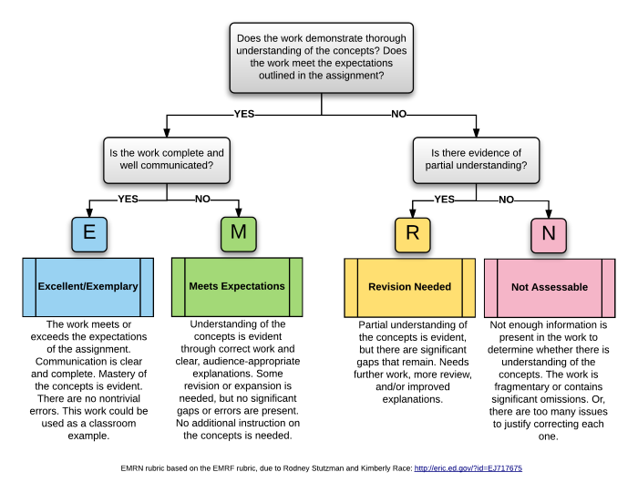

# Syllabus AGEC 652 – Spring 2023 <!-- omit in toc -->

*This syllabus is subject to revisions. You will be notified of any changes as far in advance as possible. Please monitor your Purdue email and Brightspace for updates. This version was created on April 11, 2023. (This version removes the standards associated with Function Approximation (skipped content) and adjusts the grade scales based on the new set of standards and the assignments available to demonstrate mastery).*

## Course information <!-- omit in toc -->

**AGEC 652 - Application of Quantitative Analysis: Mathematical Programming**

**CRN:** 10357

**Meeting days and times:** Mon/Wed 4:30 - 5:45 PM, Jerry S Rawls Hall (RAWL) 1071

**Instructional Modality:** Face-to-face

**Course credit hours:** 3.0 credits

**Course website:** Brightspace [(https://purdue.brightspace.com)](https://purdue.brightspace.com)

**Prerequisites:** AGEC 552 or ECON 615. Alternatively, you should have a thorough understanding of matrix algebra and differential calculus, which are fundamental to this course. Familiarity with computer programming is desirable. In addition, some of the applications will require knowledge of basic game theory concepts such as Nash and subgame perfect equilibria. Please reach out to me if you would like to discuss your background and possible supplemental materials.

## Instructor information <!-- omit in toc -->

**Instructor:** Diego S. Cardoso 

**Office hours:** **In KRAN 636** Mondays 2:30 PM to 3:30 PM, Wednesdays 11 AM to 12 PM. (Starting from Jan. 18). This course has priority on Wednesdays.

**Email:** [cardosod@purdue.edu](mailto:cardosod@purdue.edu). Please include "AGEC652" in the subject for all emails. I will read and respond to course-related emails in a timely fashion during weekdays between 9 AM and 5 PM.

**Office:** Krannert 636

**Phone:** (765) 494-4212

- [Course description](#course-description)
- [Learning outcomes](#learning-outcomes)
- [Learning resources and technology](#learning-resources-and-technology)
- [Assignments and grading](#assignments-and-grading)
  - [Types of assessments](#types-of-assessments)
  - [Tokens](#tokens)
  - [Reassessment](#reassessment)
  - [Course grade](#course-grade)
- [Academic integrity](#academic-integrity)
- [Attendance policy](#attendance-policy)
- [Course evaluation](#course-evaluation)
- [Course schedule](#course-schedule)
- [Nondiscrimination statement](#nondiscrimination-statement)
- [Accessibility](#accessibility)
- [Mental health and wellness statement](#mental-health-and-wellness-statement)
- [Basic needs security](#basic-needs-security)
- [Emergency preparation](#emergency-preparation)
- [Learning standards](#learning-standards)

--------------------

## Course description

This course will introduce you to key computational methods used in applied economics research and prepare you to use these methods in your own projects. The overall objective of this course is to expand your skills for applied research by adding numerical methods to your toolset: you will understand why and when computational methods are needed in economics research, learn to identify and model economic problems that can be solved with such methods, and apply the appropriate method for each type of problem.

This course can be conceptually divided into three parts. In the first part, we will cover the fundamentals of scientific computing and best practices for research. In the second part, we will study and apply core computational methods, including numerical calculus and linear algebra, systems of equations, and constrained and unconstrained optimization. In the third and final part, we will see how to take to data the models we learned to solve and introduce structural estimation of static models.

## Learning outcomes

By the end of this course, you should be able to:
1. Set up and manage a small scientific computing project
2. Program computational routines in Julia to solve numerical problems
3. Calculate numerical derivatives and integrals
4. Find numerical solutions for linear and nonlinear systems of equations
5. Calculate numerical function approximations
6. Find numerical solutions for constrained and unconstrained optimization problems
7. Program estimators for structural economic modeling

These learning outcomes correspond to twenty specific learning standards, which are listed [at the bottom of this syllabus](#learning-standards).

## Learning resources and technology

**Readings**

This course will be based on lecture notes/slides and select research papers. Course materials and references to research papers will be posted on the course website. 

The second part of the course will be closely related to select chapters from the textbooks listed below. While there is no official textbook for this course, I recommend that you consult these references for a deeper understanding of the methods we review in class with limited time.

- [MF02] Miranda, Mario J. and Paul L. Fackler. *Applied Computational Economics and Finance*. Cambridge, MA: MIT Press, 2002.
- [J98] Judd, Kenneth L. *Numerical Methods in Economics*. Cambridge, MA: MIT Press, 1998.
- [NW06] Nocedal, J. and S. J. Wright. *Numerical Optimization*. New York: Springer, 2nd edition, 2006.

Purdue Library offers online access to [MF02] and [NW06] and physical copies of [J98].

**Software**

Coding examples in this course will use [Julia language](https://julialang.org). Julia is a modern open-source programming language with excellent performance for numerical methods. It has an intuitive syntax and offers many packages to automate the methods we will learn and practice in this course. During the first part of the course, we will go over how to set up your coding environment for Julia.

Two good introductions to Julia are:

- Learning Julia [(https://julialang.org/learning)](https://julialang.org/learning)
- QuantEcon Julia lectures 1 to 5 [(https://julia.quantecon.org/intro.html)](https://julia.quantecon.org/intro.html).

**Hardware**

This course is designed to offer several opportunities for your to code and experiment with the methods we study. For this reason, you will need to bring a laptop to class. Please let me know if you do not have access to a laptop for that purpose.

*A note on class conduct and etiquette*: You are encouraged to bring a laptop to class. However, please limit your use of the laptop to either working on programming examples or taking notes. Please refrain from using other mobile devices – phones or tablets – as they are distracting to you and others around you (if you have an emergency or other reason that requires you to monitor these devices, please let me know in advance). If a student’s use of an electronic device is disruptive to teaching and/or learning, I will ask that the student to discontinue the use of that device. Please be considerate of those around you.

--------------------

## Assignments and grading

*(The assessment structure in this course is quite different from the traditional way in graduate courses. Please read this section closely.)*

To effectively learn computational methods, one must learn how to program and use them. In this course, all activities and assignments are designed to guide you through the process of learning the course concepts and how to put them into practice. Some of your work will be collected and graded, and it will directly contribute to your course grade. 

This course follows a methodology called Standards-Based Grading. There is a list of 20 learning standards for this course [at the bottom of this syllabus](#learning-standards), 8 of which are indicated as core standards. Instead of receiving a numerical score, you will instead be graded as either Mastered or Not Yet Mastered on each standard that is on that assessment. Standards will be assessed multiple times throughout the semester. Unlike most classes, these numbers will not be averaged. Instead, your grade will be computed in a way that rewards growth and continued mastery of the material. **Each standard will be scored as Not Yet Mastered (NY), Mastered (MS), or Continued Mastery (CM)**. These are defined as having demonstrated mastery on 0, 1, or 2+ assessments, respectively.

### Types of assessments 

There will be three types of assessments: weekly problems, mini-project, and in-class practice.

**1. Weekly problems**

In most weeks, you will be assigned a problem that relates to recent topics we covered in class. These problems will typically be released on Fridays, and you will have one week to submit your solution. 
- **Submissions are individual**. You are encouraged to discuss the problem with your classmates (and with me), but the code you submit must represent your attempt to solve the problem.
- **Weekly problems are assessed based on the [learning standards](#learning-standards) clearly indicated in each problem and will be graded as Satisfactory or Unsatisfactory.** Each submission will be graded Satisfactory if it meets the following two criteria: 
  - 1. The assignment is submitted before the deadline. Submissions past the deadline will be automatically marked Unsatisfactory.
  - 2. The assignment shows a good-faith effort to solve the proposed problems. This is similar to the criterion used for weekly problems. Submissions that do not attempt to solve a substantial part of the problem or have answers where a good-faith effort is not evident - for example, if the response is "I don't know" or "I don't understand" - will be automatically marked Unsatisfactory.
 - If your submission is *Satisfactory*, the feedback you receive will indicate whether you demonstrated mastery for each standard. If your submission is *Unsatisfactory*, it will not be used to assess any learning standards.

**2. Mini-project**

During the second half of this course, you will develop, present, and submit a mini-project. This mini-project consists of a narrow but well-defined economic question that you will formulate as a computational problem and solve. Later in the course, I will give you a list of suggested questions for your mini-project, but you are free to propose your own. 

You will submit a **one-page proposal** for the mini-project around week 9 (the exact date will be announced in advance). *This proposal will not be graded.* It will serve for me to give you feedback and suggest any adjustments to make sure your project is feasible and in line with the assignment expectations (most frequently, students shoot for projects that require much more effort than necessary).

- **Submissions are individual**. You are encouraged to discuss your project with classmates (and with me), but your mini-project question must be unique (i.e., it cannot be the same question as someone else in the course) and the materials you submit must reflect your individual work.
- A complete submission of the mini-project has three components:
  1. A 10-minute presentation to the class during Week 16.
  2. A code package that is reproducible (I can easily run it and check your results) and documented (I can find instructions on how to run it).
  3. A report that briefly defines the question, the computational approach, and the results. This report should have an 11-point font, 1.5 line spacing, 1-inch margins, and a maximum length of 3 pages (excluding tables, graphs, and references).
-There are two parts to the grading of mini-projects:
  - 1. It will be used as an additional assessment of the Scientific Programming [learning standards](#learning-standards) **plus up to 5 other standards you can choose** to be evaluated on. After you submit your proposal, we will have an individual feedback meeting where we will discuss your choice of standards. You may ask to change these standards as you make progress in the project, and I will consider these changes individually.
  - 2. The overall mini-project submission will be graded using the EMRN rubric, a four-level rubric that marks the work with grades of E (Excellent/Exemplary), M (Meets expectations), R (needs Revision), or N (Not assessable). See the diagram below summarizing how this rubric works. I will give you feedback on your presentation and indicate whether you are on track to achieve your intended grade in the mini-project.

**3. In-class practice**

In-class practice comes in two flavors:
- A) **Quick problems** will happen during short lecture breaks (5 to 10 minutes) to give you a chance to approach a new problem and try to structure a solution. In most cases, this short break will not be enough for you to program a complete solution. Don’t despair: that is intentional! The goal is for you to better understand a problem by attempting to solve it before you see a "textbook solution." 
- B) **Labs** will happen in class during a longer session (30+ minutes) where you will attempt to solve a more elaborate problem by following step-by-step instructions. Typically, you will be asked to solve a sequence of smaller problems that will lead you to a complete solution. 

The following rules apply to quick problems and labs:
- *Submissions are individual*. You are encouraged to discuss the problem with your classmates, but you must type and submit your own solution code. You will receive instructions on how to submit in-class activities in the first part of the course.
- *In-class practice submissions are graded as Satisfactory or Unsatisfactory.* Each submission will be graded Satisfactory if it meets the following two criteria: 
  - The assignment is submitted before the deadline: typically, by the end of the class (i.e., 5:45 PM). Submissions past the deadline will be automatically marked Unsatisfactory.
  - The assignment shows a good-faith effort to solve the proposed problems. This is similar to the criterion used for weekly problems.
   
**Most importantly, note that correctness is not factored into the grade for in-class practice**, so you should feel free to give your best effort on each one without fear of being counted off for wrong answers. In fact, allowing you to have misconceptions and making code errors with very low stakes is the main goal of these activities, so that you can receive prompt feedback and improve.

### Tokens

Tokens are a "currency" in this course that you can use to purchase exceptions to the course rules. **Each student begins the course with five tokens**, and tokens can purchase any of the following:
- A 48-hour extension of the submission deadline of a weekly problem.
- A 48-hour extension of the submission deadline of the in-class practice of one lecture.
- A reassessment of one learning standard (see details below).

Opportunities to earn more tokens may be made available during the semester.

### Reassessment

One key aspect of this system is constant reassessment. A standard can be reassessed explicitly on another weekly problem, even if the main topic has changed (for example, a problem assessing optimization could also assess your mastery of numerical differentiation). Additionally, you can request to be reassessed on a standard during my office hours. This reassessment can take several forms, such as:
- I might make up a problem or two and have you solve it.
- I might ask you to revise your answer to a problem and explain your rationale.
- I might ask you to explain the concept using pen and paper.

A few rules apply to office hour reassessments:
- Office hour reassessments are given at the discretion of the instructor: they are not guaranteed opportunities. Reassessment opportunities may be limited by practical considerations, such as time - particularly towards the end of the semester.
- You need to email me requesting a reassessment *at least one week in advance* of your intended reassessment date and indicate which standard you want to be reassessed.
- In order to reassess a standard, you must have earned Satisfactory in at least one weekly problem corresponding to that standard.
- You can ask to demonstrate *Continued Mastery* of a standard. However, to qualify as *Continued Mastery*, it must be at least a week after you first mastered the standard.

**Remember: The goal is to view reassessments as opportunities for you to demonstrate your continuous improvement and mastery.**

### Course grade

Your final grade in the course is determined by the following table. Each grade has a *requirement* specified in its row in the table. **To earn a grade, you will need to meet ALL the requirements in the row for that grade**. Put differently, your grade is the **highest** grade level for which **all** the requirements in a row of the table have been met or exceeded.

| Grade | Core standards | Supplementary standards | Weekly problems | Mini-project | In-class practice |
|---|---|---|---|---|---|
| A | Mastery in all 8 + Continued Mastery in at least 3 | Mastery in at least 6 + Continued Mastery in 2 | Satisfactory in at least 75% | Received E | Satisfactory in at least 75% |
| B | Mastery in all 8 + Continued Mastery in at least 1 | Mastery in at least 6 | Satisfactory in at least 75% | Received at least M | Satisfactory in at least 75% |
| C | Mastery in all 8 | Mastery in at least 4 | Satisfactory in at least 50% | Received at least R | Satisfactory in at least 50% |
| D | Mastery in at least 6 | No requirements | Satisfactory in at least 50% | Received at least R | Satisfactory in at least 50% |

A grade of F is given if none of the rows has been fully completed.

**Plus/minus grades**: Plus/minus grades will be assigned at my discretion based on how close you are to the next higher or lower grade level.

The minimum requirements for grade determination might be lowered at the time of final grade assignment at the instructor’s discretion (e.g., the required number of mastered standards to earn B might be decreased). Any adjustment in the grade scale will be applied uniformly to all students.

## Academic integrity

The work you submit in this course must reflect exclusively your effort and must not come significantly from the work of others. I encourage you to study and discuss the course materials and assignments with your peers. However, you are responsible for making sure that you follow the rules laid out in this syllabus and in Purdue University's Academic Integrity definitions [(https://www.purdue.edu/odos/osrr/academic-integrity/index.html)](https://www.purdue.edu/odos/osrr/academic-integrity/index.html). 

If for any reason you find yourself under excessive pressure or stress and feel tempted to break our Academic Integrity rules, **PLEASE STOP AND GET HELP** from me, the instructor. I am available and willing to work with you to help you succeed in this course through your legitimate hard work.

In addition to Purdue's Academic Integrity rules, in this course we will adopt the following specific policies:
- **Weekly problems**: you are encouraged to discuss the problem with your classmates (and with me), but the code you submit must represent your attempt to solve the problem. 
- **Mini-project**: you are encouraged to discuss your project with classmates (and with me), but the materials you submit must reflect your individual work.
- **In-class practice:** you are encouraged to discuss the problem with your classmates, but you must type and submit your own solution code.

**Any evidence of plagiarism will be investigated as a violation of academic integrity.** The instructor reserves the right to use any tools available for detecting plagiarism in code and text submitted in the assignments. These include, but are not limited to, [Turnitin](https://www.turnitin.com/) and software with [specialized algorithms for detecting code similarity](https://en.wikipedia.org/wiki/Content_similarity_detection#In_source_code). Comparisons might be made between submissions of enrolled students, and a bank of solutions from past offerings, and code available on the Internet.

Academic integrity is one of the highest values that Purdue University holds. Incidents of academic misconduct in this course will be addressed by the course instructor and referred to the Office of Student Rights and Responsibilities (OSRR) for review at the university level. Any violation of course policies as it relates to academic integrity will result minimally in a failing or zero grade for that particular assignment, and at the instructor’s discretion, may result in a failing grade for the course. In addition, all incidents of academic misconduct will be forwarded to OSRR, where university penalties, including removal from the university, may be considered. More details are available on our course Brightspace under University Policies and Statements.

## Attendance policy

This course follows Purdue’s academic regulations regarding attendance, which states that students are expected to be present for every meeting of the classes in which they are enrolled. Attendance will not be taken directly, but your engagement will be assessed through your participation during in-class activities and office hours and on-time assignment submissions. If you must miss a class at any point in time during the semester - be it for reasons excused by the University (see the [Academic Regulations and Student Conduct section](https://catalog.purdue.edu/content.php?catoid=15&navoid=18634#classes) or otherwise - please reach out to me as soon as possible via Purdue email so that we can communicate about how you can maintain your academic progress. I will analyze and make accommodations on a case-by-case basis. If you find yourself too sick to progress in the course, notify your adviser (or program coordinator) and notify me via Purdue email; we will work together to make arrangements based on your particular situation. If you are unable to make direct contact with me and are unable to leave word with the department because of circumstances beyond your control, you or your representative should contact or go to the [Office of the Dean of Students website](https://www.purdue.edu/advocacy/students/absences.html) to complete appropriate forms for instructor notification.

## Course evaluation

During the semester, I will ask for your informal feedback on the course. Participation is anonymous and voluntary. This early feedback will be highly appreciated. It is also an opportunity for your perceptions and concerns to be expressed and for me to make any appropriate adjustments to the course structure before the end of the semester.

Toward the end of this semester, you will be provided with an opportunity to give formal feedback on this course and your instructor. Purdue uses an online course evaluation system. You will receive an official email from evaluation administrators with a link to the online evaluation site and will receive a prompt to complete the survey when you log into Brightspace. Your participation is an integral part of this course, and your feedback is vital to improving education at Purdue University. I strongly urge you to participate in the evaluation system.

## Course schedule

The planned schedule below lists the topics we will cover in this course and the approximate weeks when we will see them. This schedule is subject to change, as we may need to make adjustments along the way.

**Part I - Introduction to Scientific Computing**

1. Computing for applied research projects and best practices (weeks 1-3)
   1. Motivation for computational methods in economics
   2. Project organization, reproducibility, version control
   3. Introduction to programming with Julia

**Part II - Core numerical methods**

2. Fundamentals of numerical operations (weeks 3-5)
   1. Basic computer architecture and numerical arithmetic
   2. Numerical differentiation and integration

3. Systems of equations (weeks 5-8)
   1. Linear systems of equations and iterative methods
   2. Nonlinear systems of equations: bisection, function iteration, Newton, quasi-Newton methods
  
4. Function approximation (weeks 8-9)
   1. Interpolation: spectral and finite element methods
   2. Functional equations and the collocation method

- *(Week 10: Spring break)*

5. Optimization (weeks 11-13)
   1. Unconstrained optimization: bracketing, Nelder-Mead, line search, trust region
   2. Constrained optimization: KKT, penalty methods

**Part III - Bringing data in**

6. Introduction to structural estimation (weeks 13-15)
   1. Fundamentals of structural estimation
   2. Review of MLE and GMM
   3. Estimating static, single-agent models
   4. Estimating static, multiple-agent models

- Week 16: Mini-project presentations

--------------------

## Nondiscrimination statement

Purdue University is committed to maintaining a community which recognizes and values the inherent worth and dignity of every person; fosters tolerance, sensitivity, understanding, and mutual respect among its members; and encourages each individual to strive to reach his or her potential. In pursuit of its goal of academic excellence, the University seeks to develop and nurture diversity. The University believes that diversity among its many members strengthens the institution, stimulates creativity, promotes the exchange of ideas, and enriches campus life. Purdue’s full Nondiscrimination Policy Statement is available at [(https://www.purdue.edu/purdue/ea_eou_statement.php)](https://www.purdue.edu/purdue/ea_eou_statement.php).

## Accessibility

Purdue University is committed to making learning experiences accessible. If you anticipate or experience physical or academic barriers based on disability, you are welcome to let me know so that we can discuss options. You are also encouraged to contact the Disability Resource Center at: drc@purdue.edu or by phone: 765-494-1247.

## Mental health and wellness statement

If you find yourself beginning to feel some stress, anxiety and/or feeling slightly overwhelmed, try [WellTrack](https://purdue.welltrack.com). Sign in and find information and tools at your fingertips, available to you at any time.

If you need support and information about options and resources, please contact or see the [Office of the Dean of Students](http://www.purdue.edu/odos). Call 765-494-1747. Hours of operation are M-F, 8 am- 5 pm.

If you find yourself struggling to find a healthy balance between academics, social life, stress, etc. sign up for free one-on-one virtual or in-person sessions with a [Purdue Wellness Coach at RecWell](https://www.purdue.edu/recwell/fitness-wellness/wellness/one-on-one-coaching/wellness-coaching.php). Student coaches can help you navigate through barriers and challenges toward your goals throughout the semester. Sign-up is completely free and can be done on BoilerConnect. If you have any questions, please contact Purdue Wellness at evans240@purdue.edu.

If you’re struggling and need mental health services: Purdue University is committed to advancing the mental health and well-being of its students. If you or someone you know is feeling overwhelmed, depressed, and/or in need of mental health support, services are available. For help, such individuals should contact [Counseling and Psychological Services (CAPS)](https://www.purdue.edu/caps/) at 765-494-6995 during and after hours, on weekends and holidays, or by going to the CAPS office on the second floor of the Purdue University Student Health Center (PUSH) during business hours. The [CAPS website](https://www.purdue.edu/caps/covid-19/index.html) also offers resources specific to situations such as COVID-19.

## Basic needs security

Any student who faces challenges securing their food or housing and believes this may affect their performance in the course is urged to contact the Dean of Students for support. There is no appointment needed and Student Support Services is available to serve students 8 a.m.-5 p.m. Monday through Friday.

## Emergency preparation

In the event of a major campus emergency, course requirements, deadlines and grading percentages are subject to changes that may be necessitated by a revised semester calendar or other circumstances beyond the instructor’s control. Relevant changes to this course will be posted onto the course website or can be obtained by contacting the instructors or TAs via email or phone. You are expected to read your @purdue.edu email on a frequent basis.

-------------------------

## Learning standards

Learning standards are organized into five topics. The eight learning standards written in bold font are classified as **core standards** (P.3, C.1, C.3, C.4, S.1, S.2, O.1, O.2). The remaining nice standards are refereed to as *supplementary standards*.

**Scientific Programming (P)**

- P.1 - I can organize a computational project with adequate version control using GitHub
- P.2 - I can produce computer code that is easy to read and well documented/commented
- **P.3 - I can write a program with adequate flow control and using functions I define**
- P.4 - I can write a program with efficient iterations and correct use of vectorization/broadcasting

**Numerical Calculus (C)**

- **C.1 - I can explain and numerically calculate derivatives with finite differences**
- C.2 - I can explain and numerically calculate derivatives with automatic differentiation
- **C.3 - I can explain and numerically calculate integrals with stochastic approximation**
- **C.4 - I can explain and numerically calculate integrals with quadrature methods**

**Systems of Equations (S)**

- **S.1 - I can numerically solve linear systems of equations and identify ill-conditioned problems**
- **S.2 - I can computationally represent nonlinear systems of equations as fixed-point and rootfinding problems and numerically solve them**
- S.3 - I can computationally represent and numerically solve nonlinear complementarity problems
- S.4 - I can identify and explain the pros and cons of different solution methods, including derivative-free, Newton, and Quasi-Newton methods

**Optimization (O)**

- **O.1 - I can computationally represent and numerically solve unconstrained optimization problems**
- **O.2 - I can computationally represent and numerically solve constrained optimization problems**
- O.3 - I can interpret and explain the output of solvers to identify performance and accuracy issues

**Structural Estimation (E)**

- E.1 - I can program a Maximum Likelihood estimator and use it to estimate a structural model
- E.2 - I can program a Generalized Method of Moments estimator and use it to estimate a structural model

